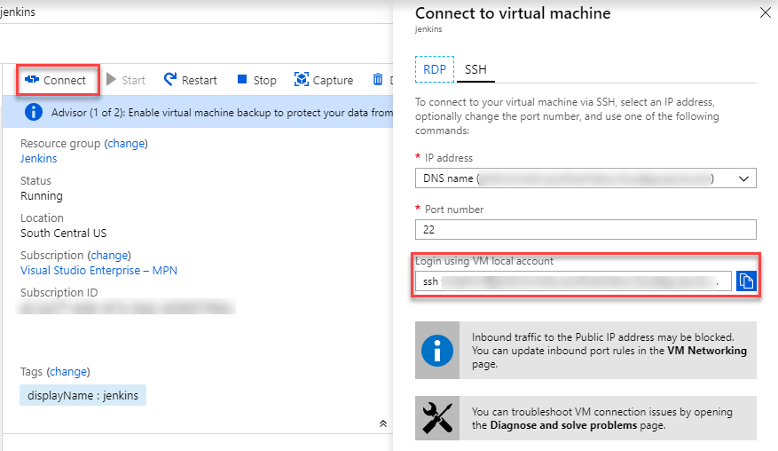
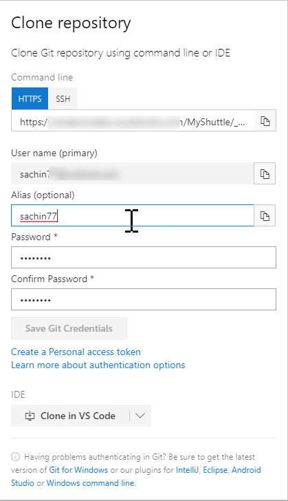
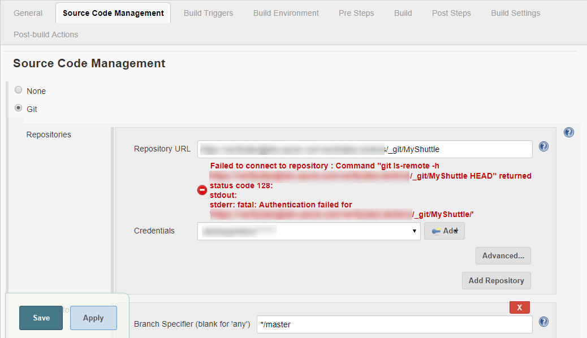
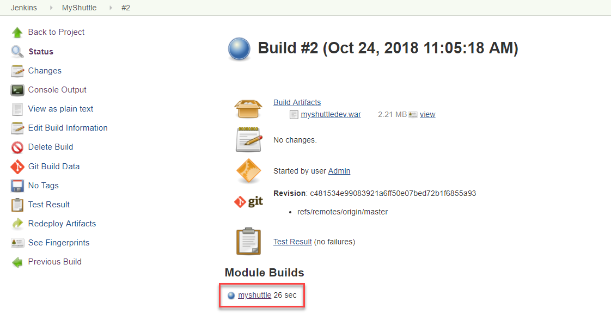
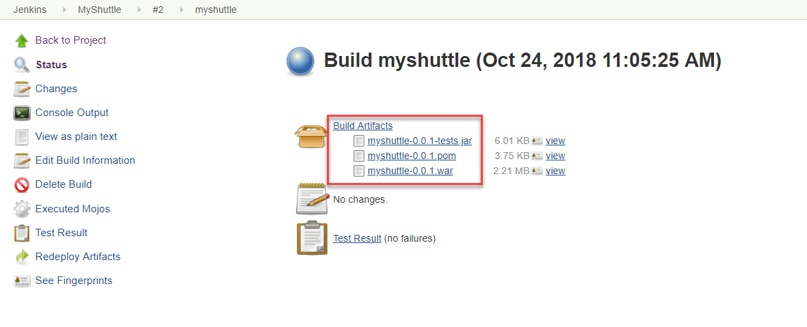

Last updated : {{ "now" | date: "%b %d,%Y" }}

## Overview

[Jenkins](https://jenkins.io/){:target="_blank"} is a very popular Java-based open source continuous integration (CI) server that allows teams to continuously build applications across platforms.

Visual Studio Team Services (VSTS) includes Team Build, a native CI build server that allows compilation of applications on Windows, Linux and Mac platforms. However, it also integrates well with Jenkins for teams who already use or prefer to use Jenkins for CI.

There are two ways to integrate VSTS with Jenkins

* One way is to completely **replace the VSTS Build with Jenkins**. This involves the configuration of a CI pipeline in Jenkins and a web hook in VSTS that invokes the CI process when source code is pushed by any member to a repository or a branch. The VSTS Release Management will be configured to connect to the Jenkins server through the configured Service Endpoint to fetch the compiled artifacts for the deployment.

* The alternate way is to **use Jenkins and Team Build together**. In this approach, a Jenkins build will be nested within the VSTS build. A build definition will be configured in the VSTS with a **Jenkins** task to queue a job in Jenkins that downloads the artifacts produced by the job and publish it to the VSTS or any shared folder. The VSTS Release Management will pick these build artifacts for deployment.

While there are pros and cons with both the approaches, the latter approach has multiple benefits:

 1. End-to-end traceability from work item to source code to build and release
 1. Triggering of a Continuous Deployment (CD) when the build is completed successfully
 1. Execution of the build as part of the branching strategy

### What's covered in this lab

This lab covers both the approaches and the following tasks will be performed

* Provision Jenkins on Azure VM using a Jenkins Template available on the Azure Marketplace
* Configure Jenkins to work with Maven and VSTS
* Create a build definition in Jenkins
* Configure VSTS to integrate with Jenkins
* Configure Release Management in VSTS to deploy the build artifacts from Jenkins

### Before you begin

1. **Microsoft Azure Account**: You will need a valid and active Azure account for the Azure labs. If you do not have one, you can sign up for a [free trial](https://azure.microsoft.com/en-us/free/){:target="_blank"}
    
1. <a href="http://www.putty.org/" target="_blank"> Putty</a> a free SSH and Telnet client

1. Set up your Azure DevOps project using the **MyShuttleDocker** template in the <a href="https://vstsdemogenerator.azurewebsites.net/?name=MyShuttleDocker&templateid=77373" target="_blank">Azure DevOps Demo Generator</a>. We will use a Java web app that runs on Docker and connects to a MySQL backend

## Setting up the Jenkins VM

1. To configure Jenkins, the Jenkins VM image available on the Azure MarketPlace will be used. This will install the latest stable Jenkins version on a Ubuntu Linux VM along with the tools and plugins configured to work with Azure. Click on the **Deploy to Azure** button below to get started.

   [](https://portal.azure.com/#create/azure-oss.jenkinsjenkins){:target="_blank"}

1. Once the Jenkins VM is provisioned, click on the **Connect** button and make a note of the `username` and the `ip address`. This information will be required to connect to the Jenkins VM from ***Putty***

    <a href="images/vmconnect_ssh1.png"></a>

    

1. To initiate a SSH tunnel, the following command needs to be run from a Command Prompt.

   ```cmd
   putty.exe -ssh -L 8080:localhost:8080 <username>@<ip address>
   ```

   <a href="images/ssh1.png"></a>

   > To run the above command, either the Putty.exe needs to be placed in the path selected in the Command Prompt or the full path of the Putty.exe need to be provided in the command.

1. Login with the user name and password that was provided during the provisioning of the Jenkins VM.

1. Once the connection is successful, open a browser on the host machine and navigate to the URL [http://localhost:8080](http://localhost:8080). The **Getting Started** page for Jenkins will be displayed.

1. The initial password needs to be provided in the **Getting Started** screen to unlock Jenkins. For security reasons, Jenkins will generate a password and save it in a file on the server.
    <a href="images/jenkinsinitialemptypwd.png"></a>
  
  
1. Return to the **Putty** terminal and type the following command to open the password file and copy the password. Press the **Esc** button and then type **:q!** at the prompt to exit the vi editor without saving the file.

    `sudo vi /var/lib/jenkins/secrets/initialAdminPassword`

    > You can double click on the password text and use **CTRL+C** to copy the text and place it in the clipboard

1. Return to the browser, paste the copied text in the Administrator password text box and click on the **Continue** button.

      <a href="images/jenkinsinitialpwd.png"></a>
  

    > Jenkins has a vast ecosystem with a strong and active open source community users contributing hundreds of useful plugins. While configuring Jenkins, choose between installing the most commonly used plugins or selected plugins.

1. The Maven plugin is also required for the lab but will be installed later. Click on the **Install suggested plugins** option to initiate the configuration.

      <a href="images/customizejenkins-plugins.png"></a>


1. To work with Jenkins, a new `Admin` user needs to be created. Provide the *User name*, *Password*, *Full name* and *Email address* in the **Getting Started** screen and then click on the **Save and Finish** button.

      <a href="images/firstadminuser.png"></a>


1. Jenkins will now be ready for use. Click on the **Start using Jenkins** button to start using it.

    <a href="images/jenkinsready.png"></a>

## Installing and Configuring Maven



1. Click the **Manage Jenkins** option on the Jenkins home page to navigate to the **Manage Jenkins** screen.

1. Select **Manage Plugins** and then select the **Available** tab and search for `maven-plugin` in the filter box.

    <a href="images/manage-jenkins1.png"></a>

1. Select the **Maven Integration Plugin** and select the **Install without restart** button to install the plugin.

    <a href="images/installmavenplugin.png"></a>

1. Once the plugin is installed, select the **Global Tool Configuration** option.

        <a href="images/manage-tools-config.png"></a>

   > Jenkins provides great out-of-the-box support for Maven. Since Maven is not yet installed, it can be manually installed by extracting the `tar` file located in a shared folder. Alternatively, when the **Install automatically** option is selected in the **Global Tool Configuration** screen, Jenkins will download and install Maven from the Apache website when a build job requires it.

1. To install Maven, select the **Install automatically** option and select the **Apply** button.

   > The latest version of Maven at the time of writing this lab is 3.5.4

    <a href="images/maveninstallerconfig.png"></a>

1. Select the **Back to Dashboard** button to return to the home page.

## Creating a new build job in Jenkins

1. From the Jenkins home page, click  the **New Item** link. Provide a name for the build definition, select **Maven project** and click **OK**.

    <a href="images/newbuilddef.png"></a>

1. Now scroll down to the **Source code Management** section. Select  **Git**  and provide the clone URL of the Azure DevOps Git repo in the format

   `http://dev.azure.com/{your org name}{team project name}/_git/MyShuttleDocker`

   

   <a href="images/jenkins-vstsrepo.png"></a>

   If your Azure DevOps Git repo is private, you should provide the credentials to access the repository. If you do not have one or don't remember the credentials, go to your Azure Repo  and select the **Clone** option. Select **Generate Credentials** and enter a `User name` and `Password`. Click **OK** to save and exit.

    <a href="images/vsts-generategitcreds.png"></a>

1. Click on the **Add \| Jenkins** option to add a new credential. Provide the `User name` and `Password` created earlier and click the **Add** button to close the wizard

    <a href="images/jenkinscredentials.png"></a>

1. Select the credential created in the previous step from the drop-down. The error message should disappear now.

     <a href="images/jenksaddvstsgit.png"></a>

   >The source code for this application has both unit tests and UI tests. Only the unit tests will be included in this lab.

1. Scroll down to the **Build** section and provide the text `package -Dtest=FaresTest,SimpleTest` in the **Goals and options** field. Click on the **Save** button to navigate to the home page of the project.

     <a href="images/jenkins-buildsettings.png"></a>

1. To configure the Post build actions in the **Post-Build Actions** section, click on the **Add post-build action** button and choose the **Archive the artifacts** option.

   <a href="images/jenkinspostbuildaction.png"></a>

1. Enter  **target/*.war** in the **Files to archive** text box. Click on the **Save** button to save the settings and return to the project page.

   <a href="images/jenkinsarchiveartifacts.png"></a>

1. Since the configuration is now completed, click on the **Build Now** option to initiate an Ad-hoc build.

   > The build progress will be displayed on the left pane in the **Build History** section

   <a href="images/adhocbuild.png"></a>

1. To view the build details and the list of build artifacts, click on the build number displayed in the **Module Builds** section.

    <a href="images/builddetails.png"></a>

   <a href="images/buildmodules.png"></a>

1. Click on the **Test Results** option to view the results of the unit tests that were included in the build definition.

Next: 

## Approach 1: [Replacing Azure Pipelines with Jenkins](./approach1)

## Approach 2: [Wrapping Jenkins Job within the VSTS Build](./approach2)

