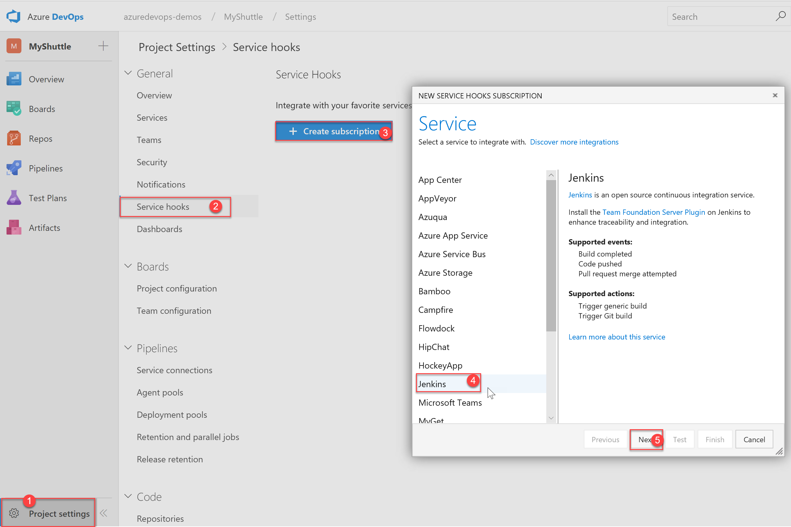
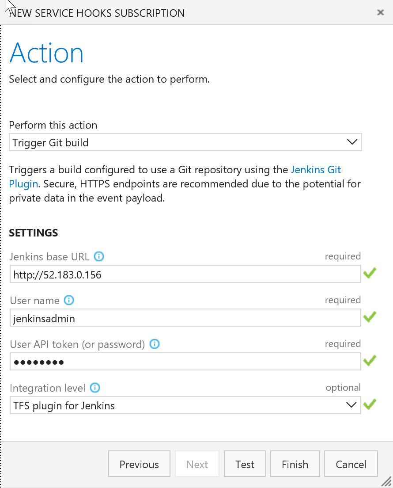
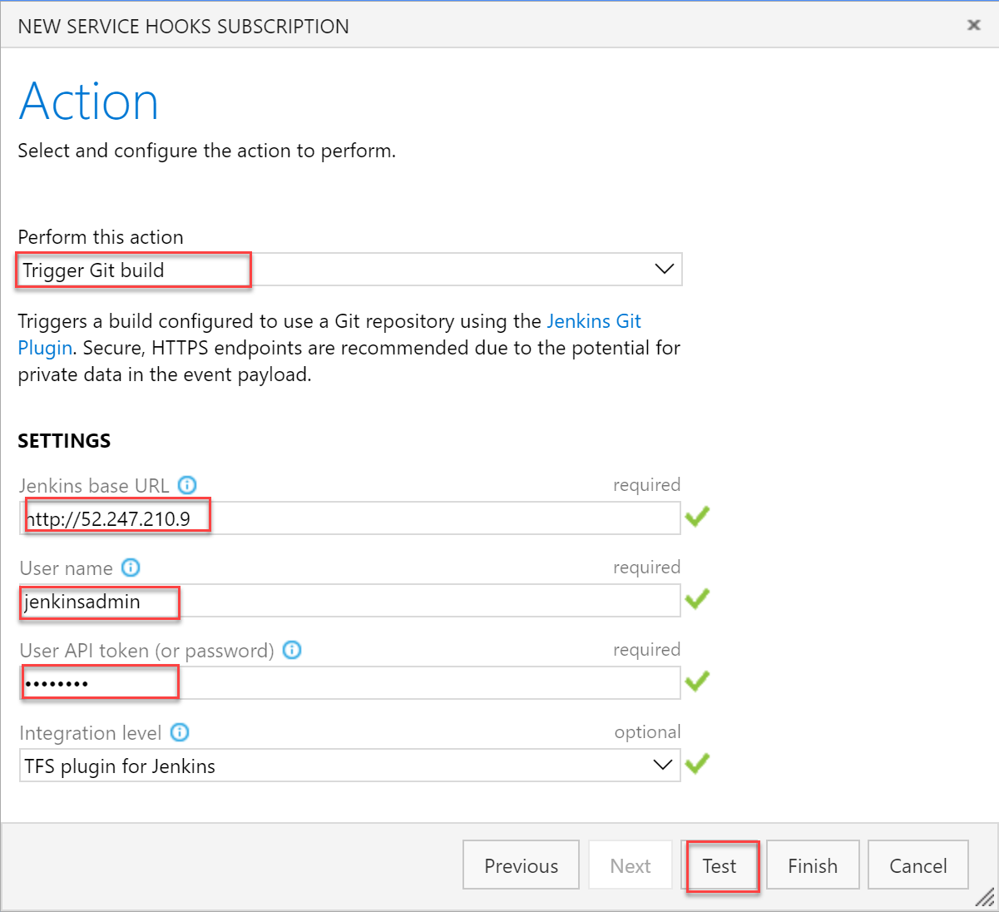

In this section, the Jenkins will be configured to run separately. A service hook will be configured in VSTS to trigger a Jenkins build whenever source code changes are pushed to a particular branch.

1. To configure the service hook, navigate to the VSTS team project page, click on the Settings icon and choose the **Service Hooks** option

    

1. On the **Service Hooks** screen, click on the **Create subscription** button. In the *New Service Hook Subscriptions* screen, click on the **Jenkins** option and then click on the **Next** button.

   

1. Select the **Code pushed** option for the **Trigger on this type of event** field, select the MyShuttleDocker as the **Repository**, master as **Branch** and then click on the **Next** button.

   

1. Provide the following details in the **Select and configure the action to perform** screen
   1. In the **Perform this action** field, select the **Trigger generic build** option

   1. In the **Jenkins base URL** field, Provide the URL of the Jenkins server in the  format `http://{ip address or the host name}`

   1. In the **User name** and **User API token (or password)** fields, provide the user name and password already configured for Jenkins

1. Click on the **Test** button to validate the configuration and then click on the **Finish** button to complete the subscription.

   

The VSTS will now automatically notify Jenkins to initiate a new build whenever any source code changes are committed on the repository.

