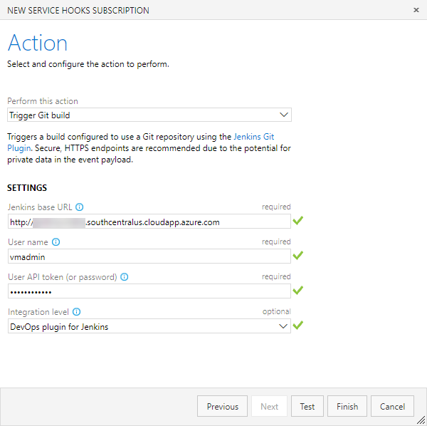

In this approach, Jenkins will be configured to run separately. A service hook will be configured in Azure DevOps to trigger a Jenkins build upon a code commit.

1. To configure the service hook, navigate to the Azure DevOps project settings page and select Settings and choose the **Service Hooks** option

1. Select **Create subscription**. In the *New Service Hook Subscriptions* screen, select the **Jenkins** option and then click the **Next** button.

   

1. Select the **Code pushed** option for the **Trigger on this type of event** field, select the MyShuttle repository and then click **Next**.

   

1. Provide the following details in the **Select and configure the action to perform** screen
   1. Select the **Trigger Git build** option

   1. Provide the **Jenkins base URL** in `http://{ip address or the host name}` format

   1. Provide the **User name**  and **Password** to trigger the build. Note this can be the administrator that you configured earlier

1. Click the **Test** button to validate the configuration and then click **Finish** .

   

The VSTS will now automatically notify Jenkins to initiate a new build whenever any source code changes are committed on the repository.

1. Try making a commit to the code - `src/main/webapp/index.jsp` would be a good candidate. This should trigger the MyShuttle build on Jenkins. You can confirm it by checking the history tab of the Jenkins services hook.  

   