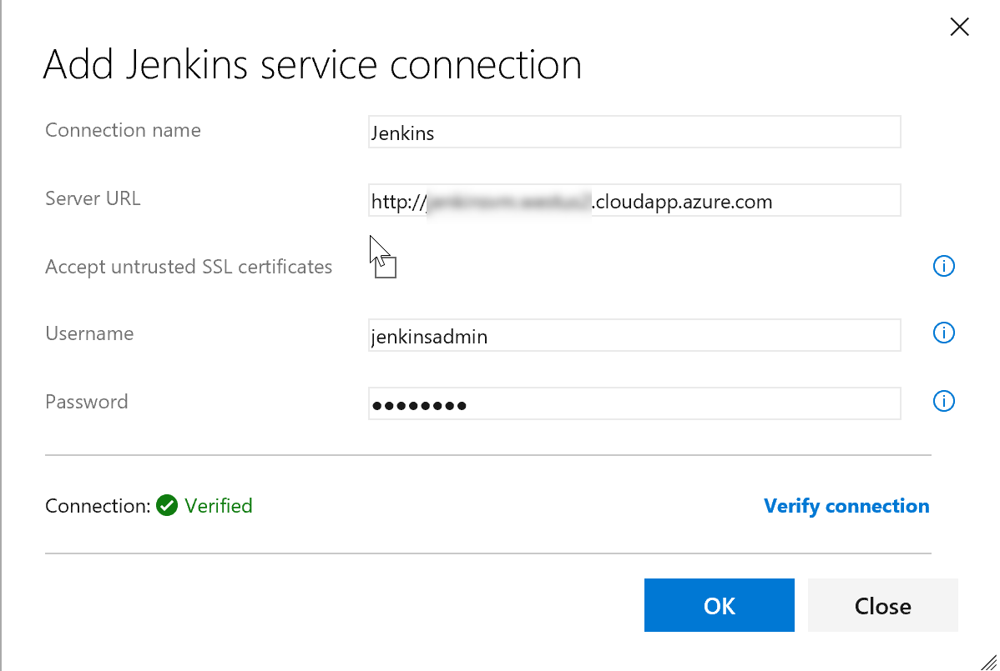
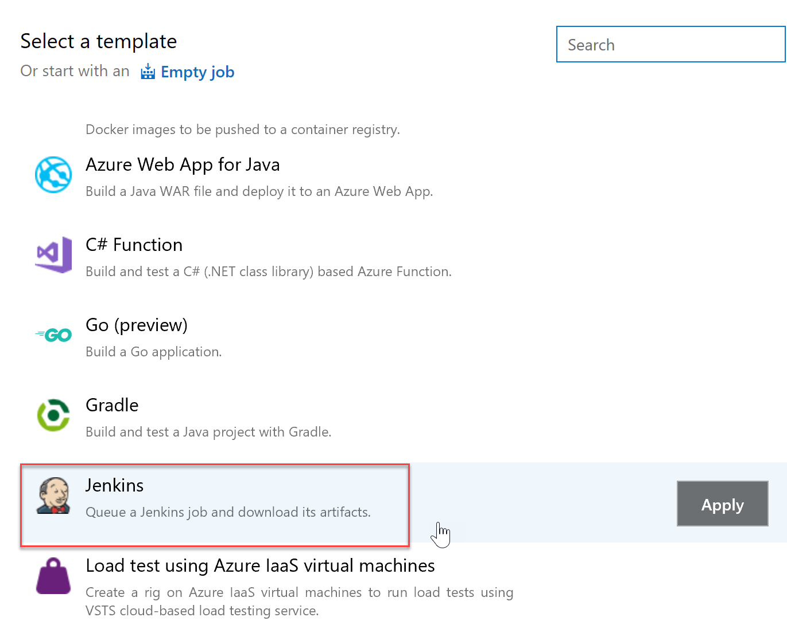
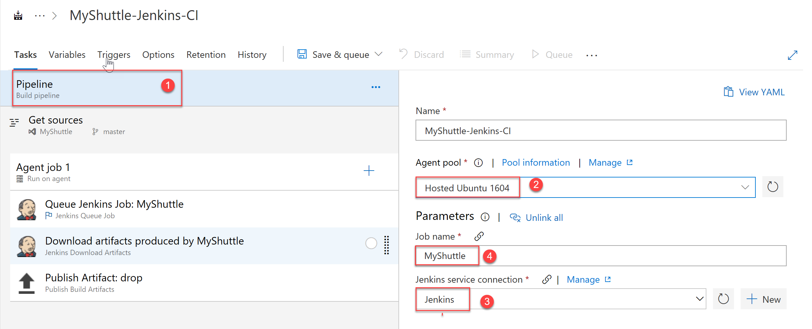
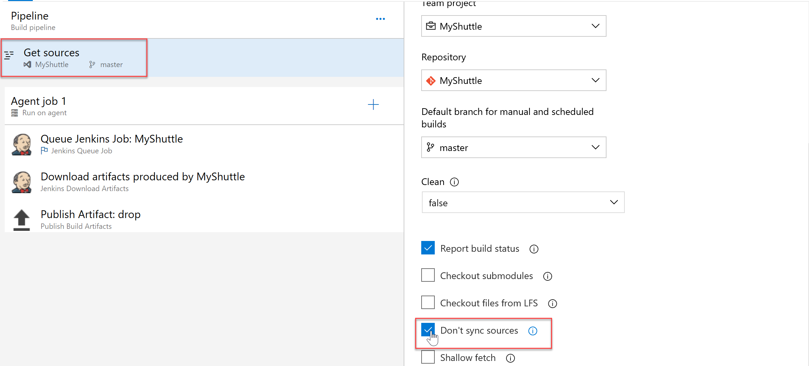
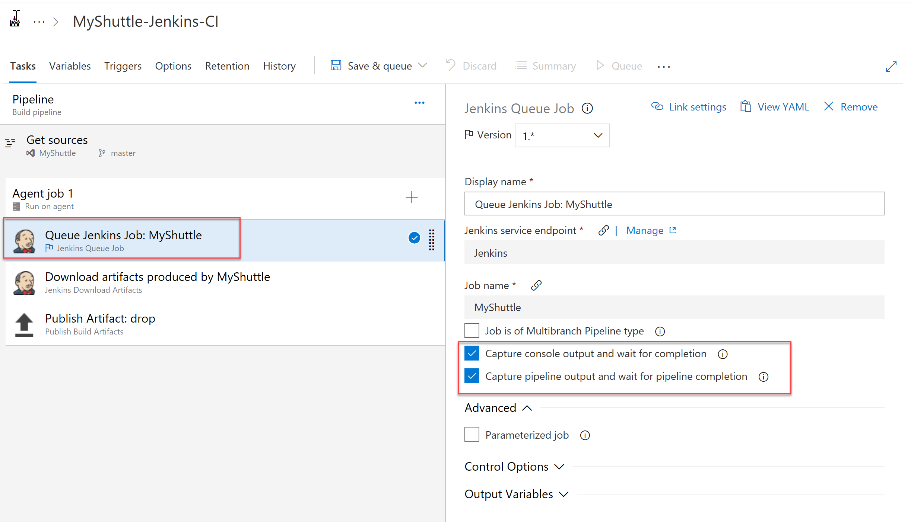
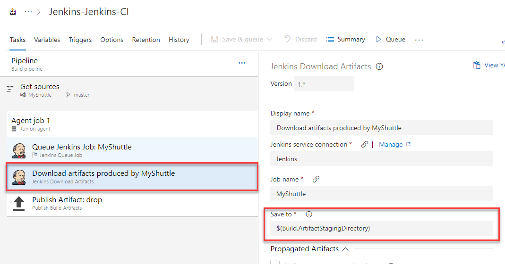
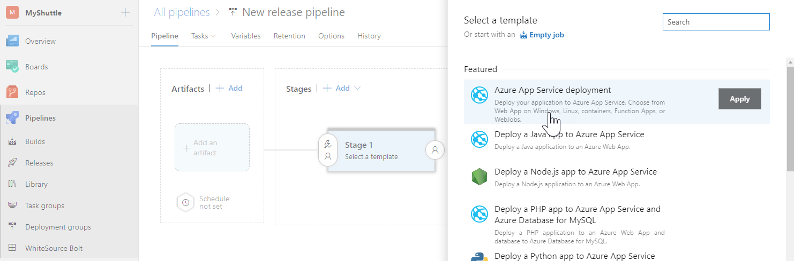
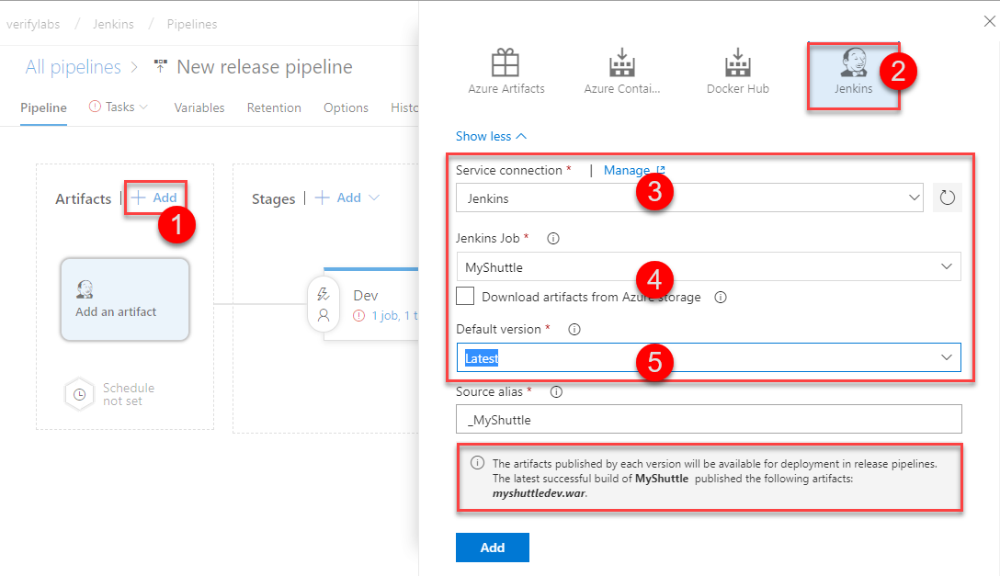

In this section, Jenkins will be included as a job within a Azure CI Pipeline. The key benefit of this approach is you can have end-to-end traceability from work items to source code to build and release pipelines.

To begin, an endpoint to the Jenkins Server for communication with Azure DevOps will be configured.

1. Go to your project settings. Select **Pipelines| Service connections**, click **New service connection** and choose **Jenkins** from the dropdown.

1. Provide a connection name, Jenkins server URL in the format `http://[server IP address or DNS name]` and Jenkins user name with password. Select **Verify Connection** and validate the configuration. If it susscessful, then select **Ok**.

   

   The next step would be to configure the build definition.

1. Go to Azure Pipelines| Builds, Click**+New**  and select **New build pipeline** to create a new build definition

1. At the time of writing this lab, Azure Pipelines did not support Jenkins in YAML. Select **Visual Designer** to create a pipeline without a YAML. 

1. Select Myshutte project and repository

1. Scroll down and select the standard **Jenkins** template Click Apply 

    

1. select Hosted Ubuntu for the Agent Queue, provide **MyShuttle** as the Job name and then select the Jenkins service endpoint created earlier.

    

1. Next, select the **Get Sources** step. Since Jenkins is being used for the build, there is no need to download the source code to the build agent. To skip syncing with the agent, select **Don't sync sources** option.

    

1. Next, select the **Queue Jenkins Job** step. This task queues the job on the Jenkins server. Make sure that the services endpoint and the job name are correct. The **Capture console output** and the **Capture pipeline output** options available at this step will be selected.

     

     >The **Capture console output and wait for completion** option, when selected, will capture the output of the Jenkins build console when the VSTS build runs. The build will wait until the Jenkins Job is completed. The **Capture pipeline output and wait for pipeline completion** option is very similar but applies to Jenkins pipelines (a build that has more than one job nested together).

1. The **Jenkins Download Artifacts** task will download the build artifacts from the Jenkins job to the staging directory

    

1. The **Publish Artifact drop** will publish to Azure Pipelines.

1. Click **Save & queue** button to save and initiate a new build.

## Deploying Jenkins Artifacts with Release Management

Next, you will configure a Azure CD pipelines to fetch and deploy the artifacts produced by the build.

1. Since the deployment is being done to Azure, an endpoint to Azure will be configured. An endpoint to Jenkins server will also be configured, if not configured earlier.

1. After the endpoint creation, click on the **Build & Release** hub and then select the **Releases** section. Click on the **+ Create a new Release definition** button to initiate a new release definition

1. Since a web application will be published to Azure, the **Azure App Service Deployment** template will be used for the configuration.

   

1. The default environment for deployment will be named as **Dev**

   

1. To link the release definition with the MyShuttle build on Jenkins, click on the **+Add** button to add an artifact

1. In the **Add artifact** screen, Select **Jenkins** as the *Source type*, select the Jenkins endpoint configured earlier and provide **MyShuttle** for the *Source(Job)*

   >The Source(Job) should map to the project name configured in Jenkins

1. If the Jenkins server and the source location is configured correctly, once the publishing of the artifacts is completed, a message with the output file name **myshuttledev.war** will be displayed.

   

1. The output .war file can now be deployed on Azure. For details on the deployment, refer to the [Deploying a MySQL Backed Tomcat app on Azure Web App](../tomcat/)