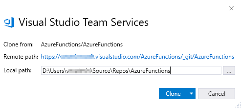
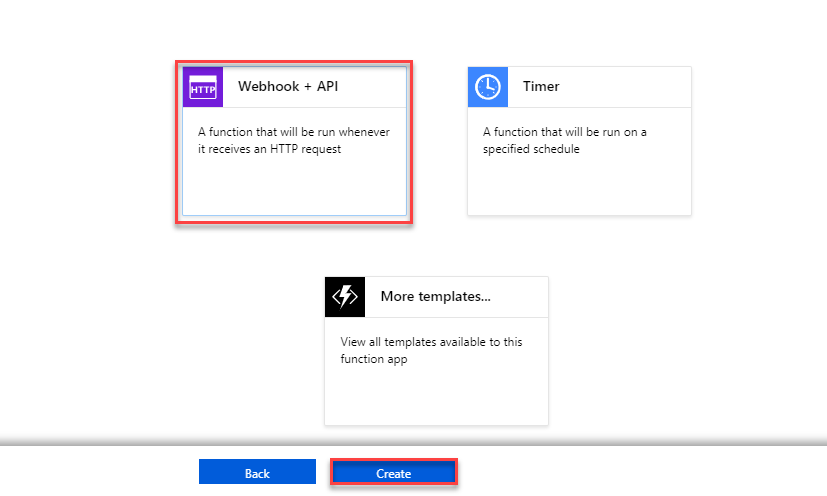
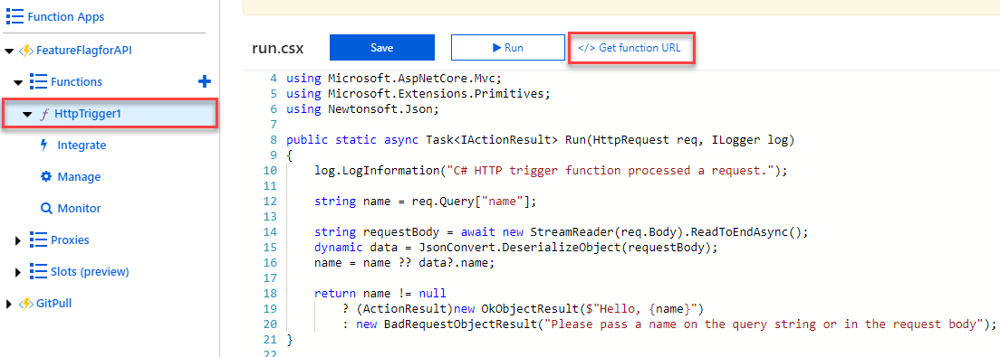
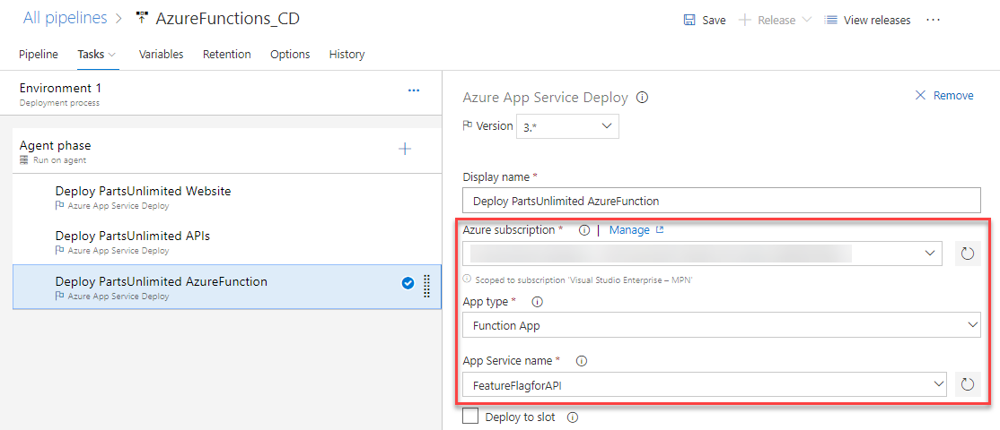

# Deploying Azure Functions using Azure DevOps

## Overview

Azure Functions is an event driven, compute-on-demand experience that extends the existing Azure application platform with capabilities to implement the code, triggered by events occurring in Azure or third-party services as well as on-premises systems. Azure Functions allows developers to act, by connecting to data sources or messaging solutions, thus making it easy to process and react to events. Developers can leverage Azure Functions to build HTTP-based API endpoints that are accessible by a wide range of applications, mobile and IoT devices.

**Lab Scenario**: In this lab, you will be using a fictional eCommerce website - *PartsUnlimited*. The PartsUnlimited team wants to roll out a new discount for its employees and customers, and wants to build Azure Functions that will retrieve the right discount depending on whether the logged in user is an employee or a customer.

 ## What is covered in this lab?

 In this lab, you will

 * Generate the *PartsUnlimited* project in the **Azure DevOps Services** account with **Azure DevOps Demo Generator** tool.
 * Setup **Azure Functions** in Azure portal and add code via Visual Studio.
 * Configure a **Build pipeline** in Azure DevOps Organization to build and test the code.
 * Configure a **Release pipeline** in Azure DevOps Organization for Website, API and Azure Functions.

## Pre-requisites for the lab

Refer the [Getting Started](../Setup/) page to know the prerequisites for this lab.

The lab additionally requires Visual Studio 2017 version 15.4 or later with [.Net Core SDK](https://www.microsoft.com/net/learn/get-started/windows#windows) and [Azure Development Tools for Visual Studio](https://docs.microsoft.com/en-us/azure/azure-functions/functions-develop-vs) installed.

## Create the required Azure resources

1. Click the below **Deploy To Azure** button to provision an Azure App service plan with two web apps.

   [](https://portal.azure.com/#create/Microsoft.Template/uri/https%3A%2F%2Fraw.githubusercontent.com%2FMicrosoft%2Falmvm%2Fmaster%2Flabs%2Fvstsextend%2Fazurefunctions%2Farmtemplate%2Fazuredeploy.json)

1. It should take approximately 5-10 minutes to provision the resources. Once the deployment is successful, you will see the resources as shown.

   

## Setting up the Azure DevOps team project

1. Click the [Azure DevOps Demo Generator](http://azuredevopsdemogenerator.azurewebsites.net/?TemplateId=77376&Name=AzureFunctions_BuildWorkshop) link and follow the instructions in [Getting Started](../Setup/) page to provision the project to your **Azure DevOps**.

## Exercise 1: Cloning an existing repository

1. Navigate to the **Repos** hub. Select **Clone** and select **Clone in Visual Studio**

     

1. An instance of **Visual Studio** opens and you might be prompted to sign into to your account. Sign in to your account.

1. Set the local path where you want the local repository to be placed and select **Clone**.

     

1. In Team Explorer under **Solutions**, you will see  **PartsUnlimited.sln**. Double click the solution to open the project.

     

## Exercise 2: Create Azure Function in Azure Portal and in Visual Studio

In this exercise, you will create an **Azure Functions** App from the Azure portal and then add code by creating an Azure Functions project in Visual Studio.

The Azure Functions created in this exercise will act as a switching proxy or the mechanism to return to different (discount) information based on the user logged in to the application. Although you have used a simple condition here, this could also use more complex rules which could potentially be hidden behind another web api call.

1. Login to the Azure Portal. Select the `+ Create a resource` button found on the upper left-hand corner of the Azure portal, then select Compute > Function App.

    

1. Create a Function app with similar settings as specified in the below image. Select Create to provision and deploy the function app.

    

1. Select the Notification icon in the upper-right corner of the portal and watch for the Deployment succeeded message. Select **Go to resource** to view your new function app.

    

1. Expand your new function app, then click the + button next to **Functions**.

1. In the *Get started quickly page, select `WebHook + API`, Choose `CSharp` as language for your function, and then click on **Create this function**.

     

   > This lab uses CSharp as script language for the function, but a function can be created in any supported language.

1. Select HttpTriggerCSharp1 in Functions and click </>Get Function Url.

    
    
1. Copy the Azure Function URL and save to notepad. You will need this URL later in the exercise.

    

1. Return to the Visual Studio, double click on the **PartsUnlimited.sln** solution to open it. You will have to add code to the Functions App. While there are many ways of doing it, you will use Visual Studio in this lab. You will write code to redirect to the right APIs based on the user login, to return different (discount) information.

1. Right click on the solution and select **Add** and select **New Project**.

    

1. Select **Cloud** under **Visual C#** category, select **Azure Functions** as the type of this project. Enter **PartsUnlimited.AzureFunction** for the name and append **\src** at the end of the location, then click OK.

    

1. Select **HttpTrigger** template, **Azure Functions v1 (.NET Framework)** from the framework dropdown and click OK.

    
    
1. Expand the **PartsUnlimited.AzureFunction** project, open **Function1.cs** and then replace the existing code with the following code.

    ```C Sharp
    using System;
    using System.Linq;
    using System.Net;
    using System.Net.Http;
    using System.Threading.Tasks;
    using Microsoft.Azure.WebJobs;
    using Microsoft.Azure.WebJobs.Extensions.Http;
    using Microsoft.Azure.WebJobs.Host;

    namespace PartsUnlimited.AzureFunction
    {
    public static class Function1
    {
        [FunctionName("HttpTriggerCSharp1")]
        public static async Task<HttpResponseMessage> Run([HttpTrigger(AuthorizationLevel.Function, "get", "post", Route = null)]HttpRequestMessage req, TraceWriter log)
        {
            var userIdKey = req.GetQueryNameValuePairs().FirstOrDefault(q => string.Equals(q.Key, "UserId", StringComparison.OrdinalIgnoreCase));
            var userId = string.IsNullOrEmpty(userIdKey.Value) ? int.MaxValue : Convert.ToInt64(userIdKey.Value);
            var url = $"https://<<YourAPIAppServiceUrl>>/api/{(userId > 10 ? "v1" : "v2")}/specials/GetSpecialsByUserId?id={userId}";
            using (HttpClient httpClient = new HttpClient())
            {
                return await httpClient.GetAsync(url);
            }
        }
    }
    }

    ```

1. Navigate to the resource group which was configured in the **Create required Azure resources** exercise. Click **PartsUnlimited-API-XXXXXXX.azurewebsites.net** and click the Copy icon under the URL section to copy the whole URL. Copy and replace the value of `https://<<**YourAPIAppServiceUrl**>>` in url variable with API app service name.

1. In Visual Studio, open **StoreController.cs** from the path **PartsUnlimitedWebsite > Controllers > StoreController.cs**.

    

1. In **StoreController.cs** file, replace the URL variable in *line 46* with the **Function url** copied in Step 7.

    

1. Click **Changes** in the Team Explorer, provide a comment and select **Commit all and Push** to push the changes to the remote repository.

    

## Exercise 3: Setup continuous integration in Team Services

In this exercise, you will look at the build definition to get an insight of how the code is built as part of the CI pipeline.

1. Click on the **Pipelines** hub in Azure DevOps portal and notice that **Builds** menu is the default selected option. Since there is only one build definition - *AzureFunctions_CI*, click **Edit** option in the menu to view the tasks of that build definition.

    

1. Before the build is executed, you will make this a **CI** build. Clickon the **Triggers** tab in the build definition. Enable the **Continuous Integration** trigger. Click **Save & queue**  to save the changes and trigger a build. This will ensure that the build process is automatically triggered every time you commit a change to your repository.

    
    

1. A new build is started. You will see a link to the new build on the top of the page. Click the link to watch the live logs of the build as it progresses. Wait for the build to complete and succeed before proceeding to the next section.

     

## Exercise 4: Creating a CD pipeline in Team Services

1. Once the build succeeds, click the **Releases** option under the **Repos** hub.

     

1. In the Release page, click *Edit* for the highlighted release definition- **AzureFunctions_CD**. 

     

1. Select the artifact trigger and make sure the **Continuous deployment** trigger is enabled.

     

1. To deploy **PartsUnlimited Website**, click Tasks and select the first **Deploy PartsUnlimited Website** task, and configure the inputs as shown below.

     

    * If your Azure subscription is not listed or if you want to use an existing service principal, click on the `Manage` link.

        * Click on the +New Service Connection button and select the Azure Resource Manager option. Provide Connection name, select the Azure Subscription from the list and the click on the Ok button. The Azure credentials will be required to authorize the connection.

            

        * If your Azure subscription is already listed, select the Azure subscription from the drop down list and click Authorize.

             

1. Choose the pre-created **PartsUnlimited-Web-XXXX** name for **App Service Name** from the drop down.

1. For the **PartsUnlimited APIs**, select the second task and configure the inputs as shown below. Choose **PartsUnlimited-API-XXX** for the **App Service Name** field from the drop down.

    

1. Select the third task to deploy **PartsUnlimited Azure Function** and configure the inputs as shown below. Choose the pre-created **Azure functions** name for the **App Service Name** field from the drop down.

    

1. Click on *Save*. In the Save dialog box, click OK. To test the release definition, click **Release** and then **Create Release**.

     

1. On the Create new release dialog box, click **Create**.

    

1. You will notice a new release being created. Select the link to navigate to the release.

    

1. You can watch the live logs for the deployment as it happens. Wait for the release to be deployed to the Azure web app. Wait for the release to complete and happen before proceeding to the next section.

    

## Exercise 5: Verify the Deployment

1. Once deployment has completed, go to the Azure portal. In your resource group, select **PartsUnlimited-Web-xxxxx** web app and click Browse.

    

1.  Navigate to Oil category, notice that products are showing discount as **10%**.

    

1. Now log in as **Administrator@test.com** with password **YouShouldChangeThisPassword1!** and navigate to Oil category again. You will notice that for this user, Azure function routes the request to another API and shows discount as **30%**.

    
    
    

You have connected PartsUnlimited website to the Web API and has used Azure function to retrieve data from either v1 or v2 of the API based on the user ID.
