Last updated : {{ "now" | date: "%b %d,%Y" }}

## Overview

Last updated : {{ "now" | date: "%b %d, %Y" }}.

[Octopus Deploy](https://Octopus.com) is an automated deployment server that makes it easy to automate deployment of ASP.NET web applications, Java applications, NodeJS application and custom scripts to multiple environments.

Azure DevOps includes a first-class, powerful release management capability that simplifies deployment of any application to any platform. But teams who prefer or already have chosen Octopus deploy, can use the **[Octopus Deploy Integration](https://marketplace.visualstudio.com/items?itemName=octopusdeploy.octopus-deploy-build-release-tasks)** extension available on **Extensions for Azure DevOps** that provides Build and Release tasks to integrate Octopus Deploy with Azure DevOps and Azure DevOps Server.

This lab shows how we can integrate Azure DevOps/Azure DevOps Server Build with Octopus to automate build and deployment of an ASP.NET Core application to an Azure App Service.

## Prerequisites for the lab

1. **Microsoft Azure Account**: You will need a valid and active Azure account for the Azure labs. If you do not have one, you can sign up for a [free trial](https://azure.microsoft.com/en-us/free/){:target="_blank"}

    * If you are an active Visual Studio Subscriber, you are entitled for a $50-$150 credit per month. You can refer to this [link](https://azure.microsoft.com/en-us/pricing/member-offers/msdn-benefits-details/){:target="_blank"} to find out more information about this including how to activate and start using your monthly Azure credit.

    * If you are not a Visual Studio Subscriber, you can sign up for the FREE [Visual Studio Dev Essentials](https://www.visualstudio.com/dev-essentials/){:target="_blank"} program to create an **Azure free account** (includes 1 year of free services, $200 for 1st month).

1. You will need an **Azure DevOps Organization**. If you do not have one, you can sign up for free [here](https://www.visualstudio.com/products/visual-studio-team-services-vs){:target="_blank"}

## Setting up the Environment

Octopus Deploy has two components:

* **Octopus Server** - a centralized web front-end that orchestrates deployments , and
* **Tentacle** - agent that needs to be on every target endpoint.

We will spin up a Octopus server on Azure. Click the **Deploy to Azure** button below to provision a Octopus Server.

{:target="_blank"}

1. Click on **Create** button.

   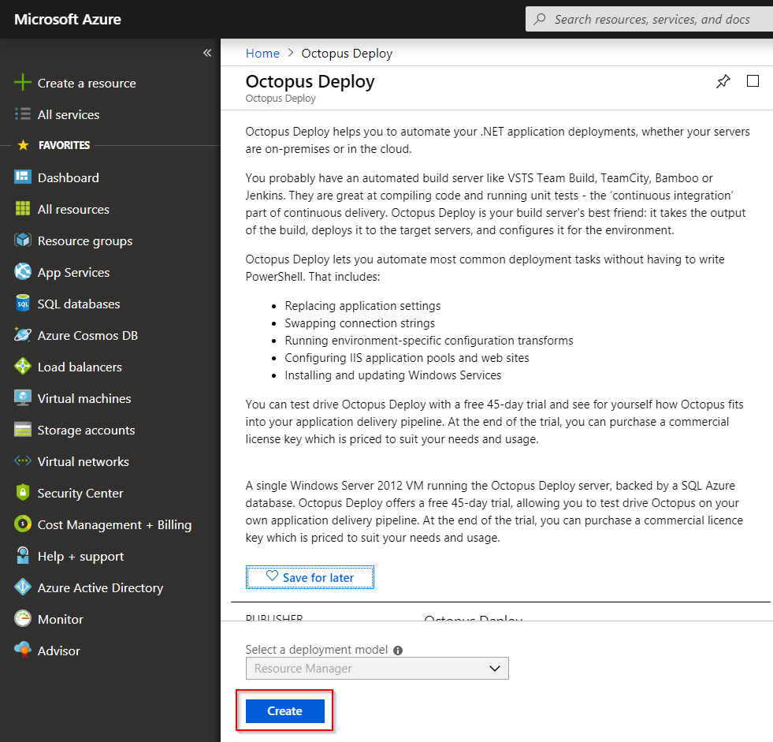

1. Click on **Create new** provide the **Resource group** name and click **OK**.
   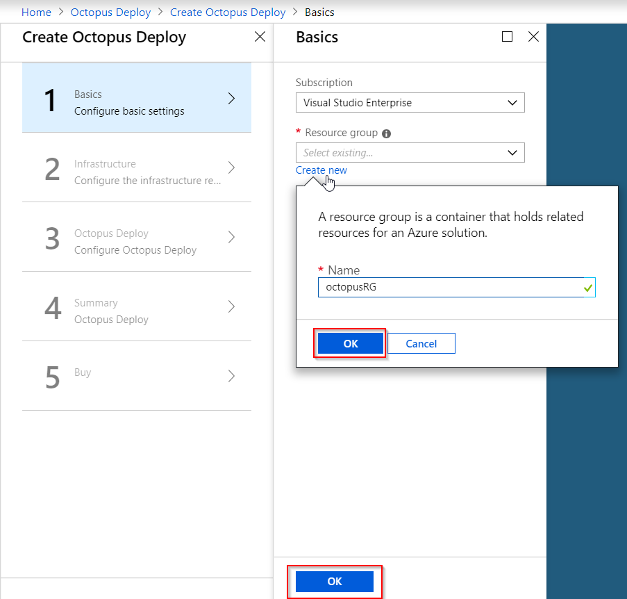

1. Provide Octopus server **Domain Name**, VM Admin **username and password**, and SQL admin **username and password**. Note down the Domain Name (DNS) as this is used later to connect to Octopus server.

   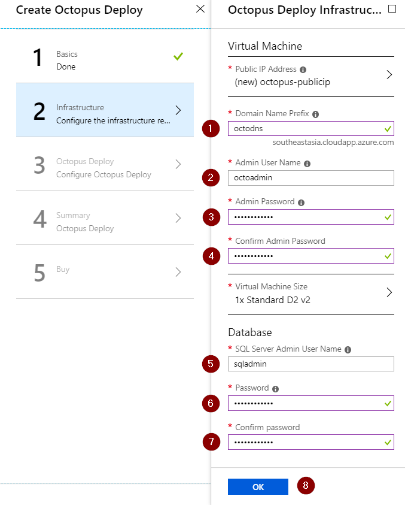

1. Provide Octopus Admin **username and password**. This is used to login to Octopus server. Also provide your **name, organization name** and **email address** to activate trial license for octopus server. Click OK.

   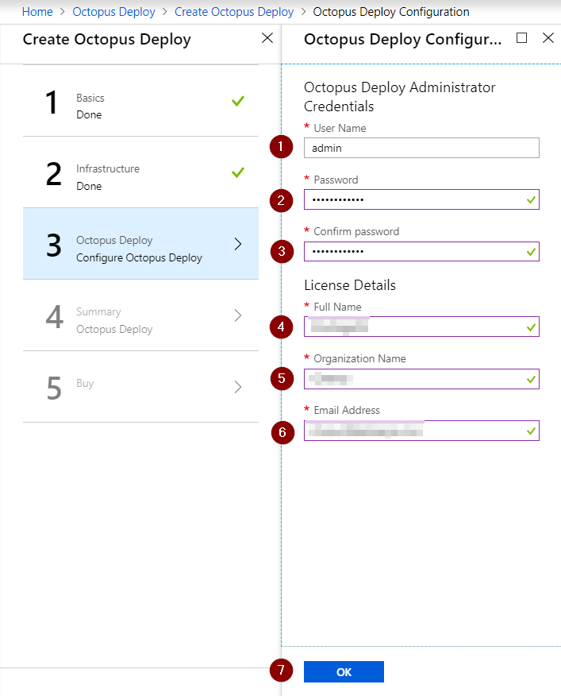

1. Click **OK** in the Summary section.

   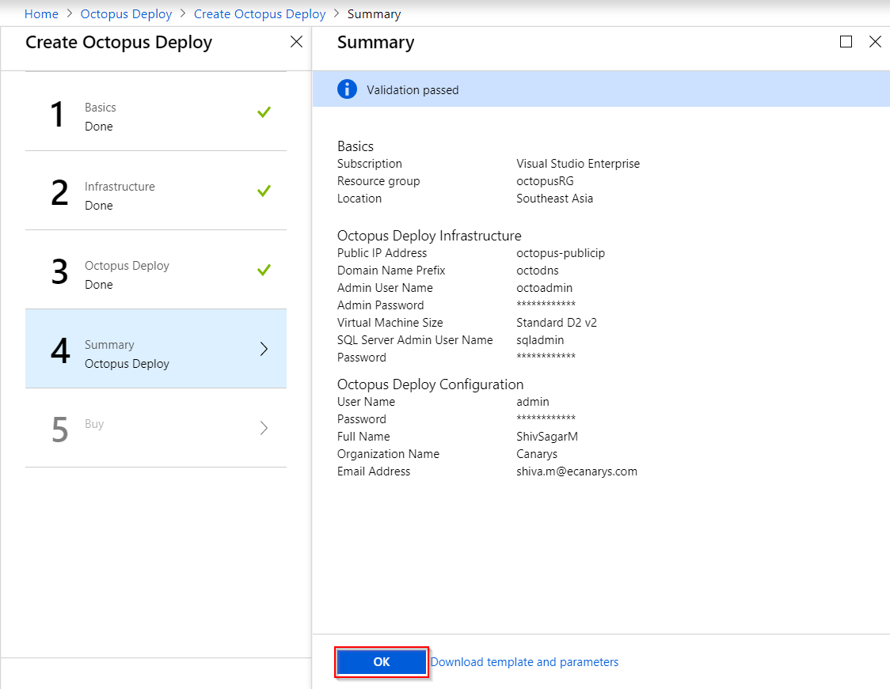

1. Click **Create** in the Buy section.

   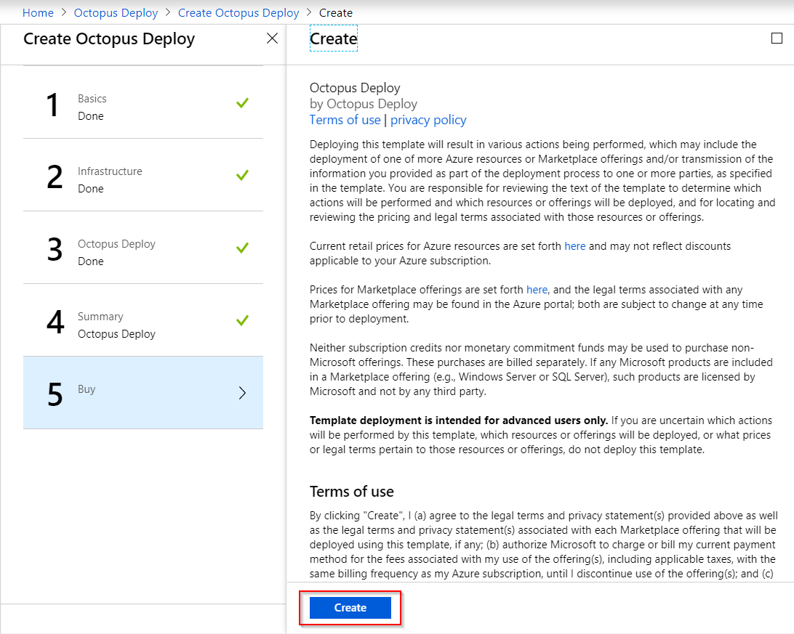

1. It takes approximately 15 minutes for the deployment to complete. Once the deployment is successful, connect to Octopus server using DNS, and login with Octopus Admin username and password.

   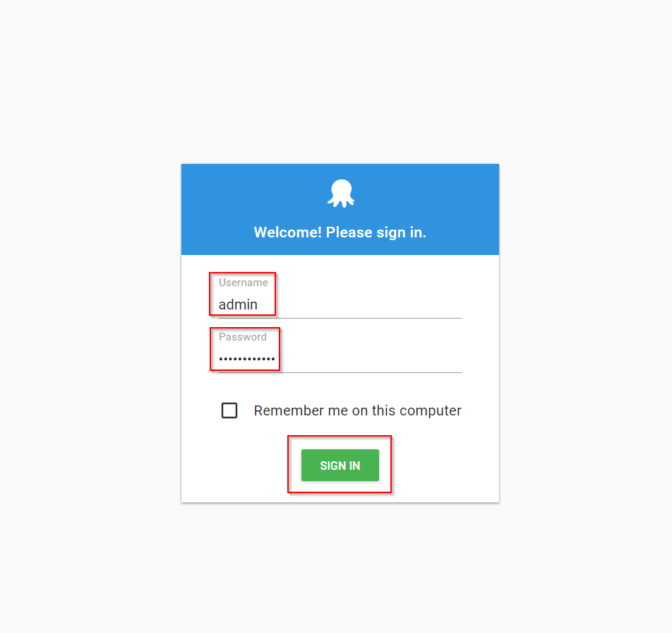

1. You will see the Octopus deploy web portal.

    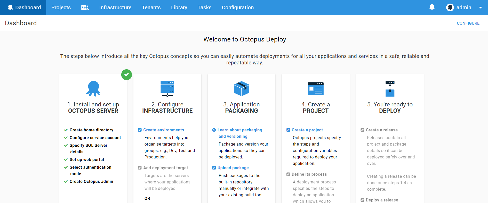

## Generating Service Principal Names details from Azure

We need to generate SPN details to get **Tenant ID**, **Application ID** and **Application Password/Key** which will be used in later part of the lab.

1. Login to your Azure account and click on **Cloud Shell**.

    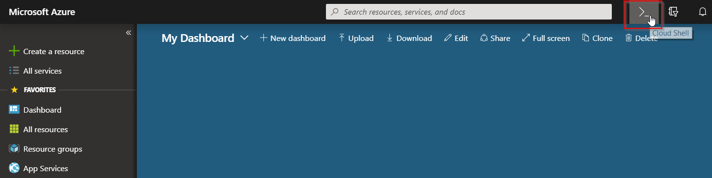

1. Select **Bash** or **Powershell** to run the command which will generate the SPN details.
 
    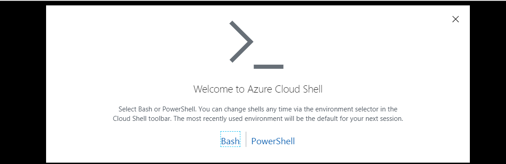

1. Create Storage account as Azure Cloud Shell requires an Azure file share to persist files, If you already have one select it or create new. Select the subscription and click on **Create storage**. 
    

1. Once the storage account is provisioned, run the below command to get the SPN details.

    `az ad sp create-for-rbac --name (provide a short name) --password (provide a password)`
    
    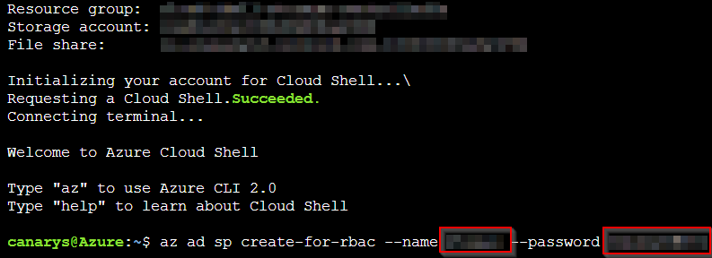

1. Note down the **Tenant ID**, **Appliction ID** and the **Password**. 

    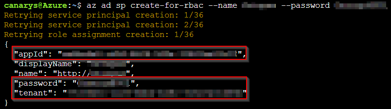

## Setting up the Deployment Target

In this lab, we will use Azure WebApp as the deployment target.

Click the **** button below to provision Azure WebApp.

{:target="_blank"}

1. Provide **Web App name** and **Resource Group**. You can either create new Resource group or use existing one, and click **Create**

    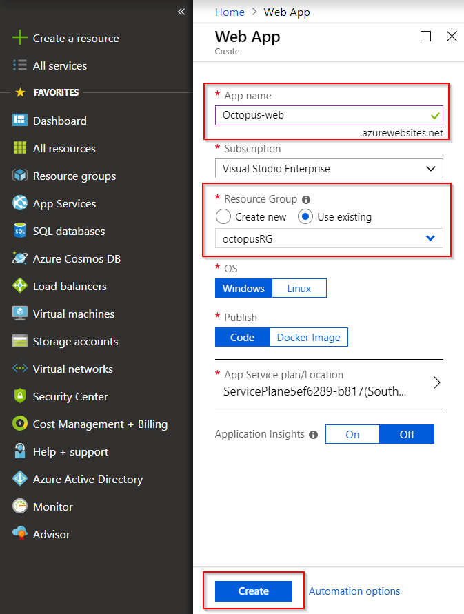

## Generate Octopus API Key

API key is used to authenticate Azure DevOps with Octopus server. Using API key lets you keep your username and password secret.

1. From the Octopus Deploy portal, select **Profile** under *User* menu.

   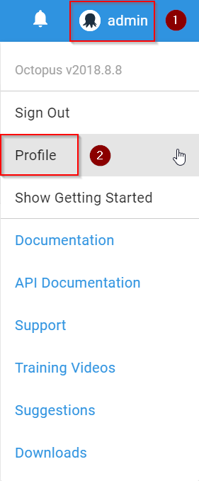

1. Select **My API Key** and click **New API Key** to create one. We will use the API Key to connect Octopus Deploy with Azure DevOps

   

1. Specify a **purpose**, for e.g., **Azure DevOps Integration** and click **Generate New**.

   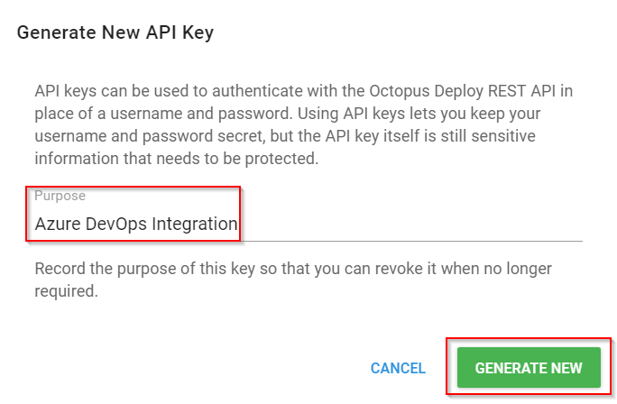

1. Copy the API Key to clipboard and save this somewhere as you may use it for future requests.

   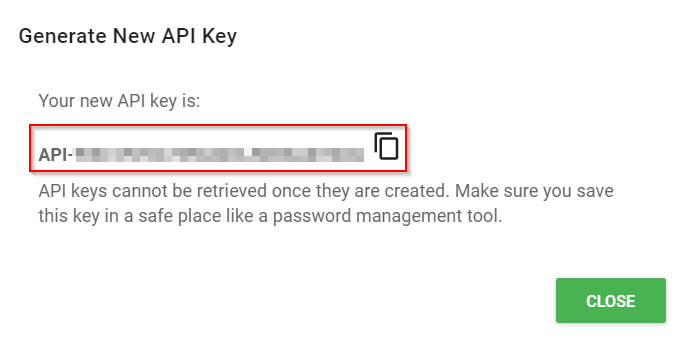

## Setting up the Azure DevOps team project

1. Use [Azure DevOps Demo Generator](https://azuredevopsdemogenerator.azurewebsites.net/?Name=octopus&TemplateId=77370){:target="_blank"} to provision the project on our Azure DevOps Organization.

   > **Azure DevOps Demo Generator** helps you create team projects on your Azure DevOps Organization with sample content that include source code, work items, iterations, service endpoints, build and release definitions based on the template you choose during the configuration.

   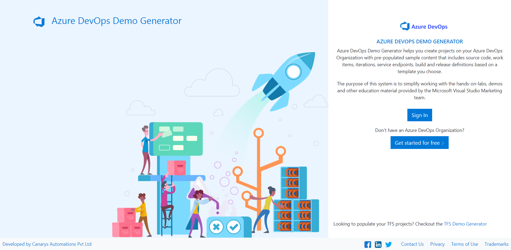

1. Select the Organization, provide a name for your project. Provide the Octopus URL (VM's DNS URL) that was created previously, API Key and click on **Create Project**.
Once the project is provisioned, click the URL to navigate to the project.

   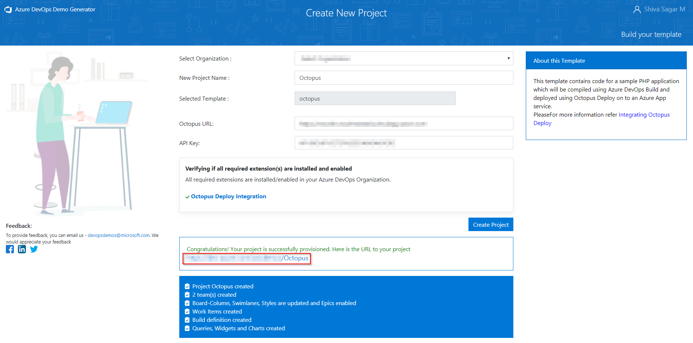

   

## Exercise 1: Configure Deployment Target in Octopus Server

Let us create a deployment environment in Octopus server and link to Azure using Management Certificate. Environments are deployment targets consisting of machines or services used by Octopus Deploy to deploy software. With Octopus Deploy,  we  can deploy software to Windows servers, Linux servers, Microsoft Azure, or even an offline package drop.

Grouping  our deployment targets by environment lets you define your deployment processes and have Octopus deploy the right versions of our software to the right environments at the right time.

In this lab, we are using Azure App Service as the deployment target.

1. From the Octopus portal, select **Create environments** to go into the **Infrastructure** page

   

1. Once inside, click **Add Environment**.

   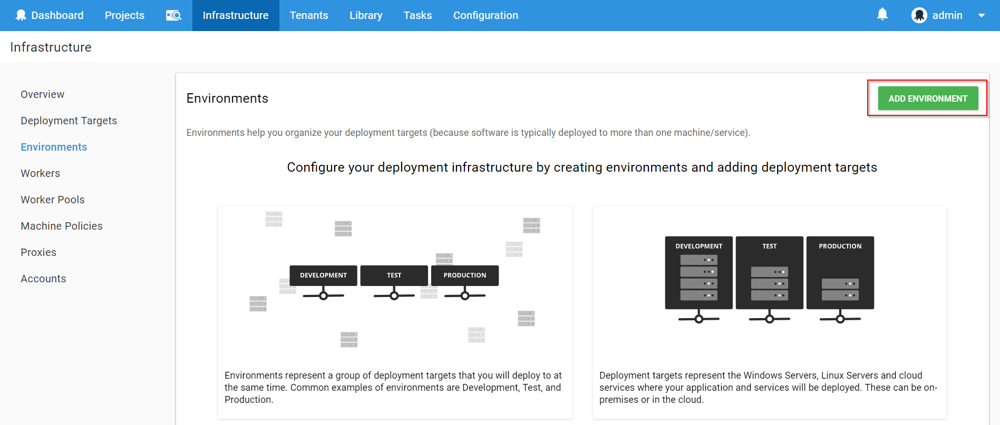

1. Provide the environment name and click **Save**.

   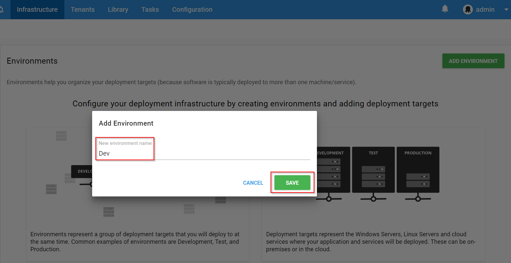

1. Octopus Deploy provides first-class support for deploying Azure Cloud Services and Azure Web Applications. To deploy software to Azure,   we must add  our  Azure subscription to Octopus Deploy, and then use the built-in step templates to deploy to the cloud. Once the environment is created, click on **Accounts** select **Azure Subscription** form **ADD ACCOUNT** dropdown.

   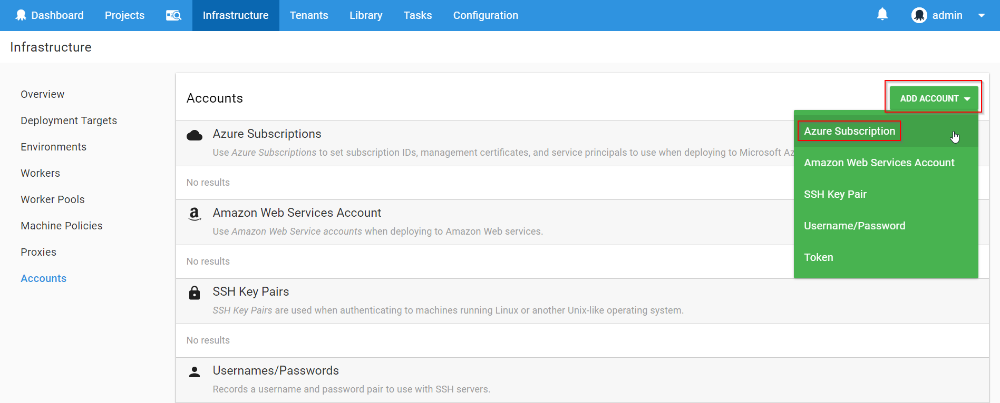

1. Octopus Deploy authenticates with Azure in one of two methods:

    * To deploy to Azure Resource Manager (ARM), Octopus requires [**Azure Service Principal Account**](https://octopus.com/docs/infrastructure/azure/creating-an-azure-account/creating-an-azure-service-principal-account){:target="_blank"}

    * [**Azure Management Certificate**](https://octopus.com/docs/infrastructure/azure/creating-an-azure-account/creating-an-azure-management-certificate-account){:target="_blank"} is used by Octopus to deploy to Cloud Services and Azure Web Apps.

    Enter the following details -

    * **Name**: Provide an account name
    * **Subscription ID**: Your [Azure Subscription ID](https://blogs.msdn.microsoft.com/mschray/2016/03/18/getting-your-azure-subscription-guid-new-portal/){:target="_blank"}
    * **Authentication Method**: Choose **Use a Service Principal**
    * **Tenant ID**, **Application ID**, **Application Password/Key**: Created earlier in the lab

   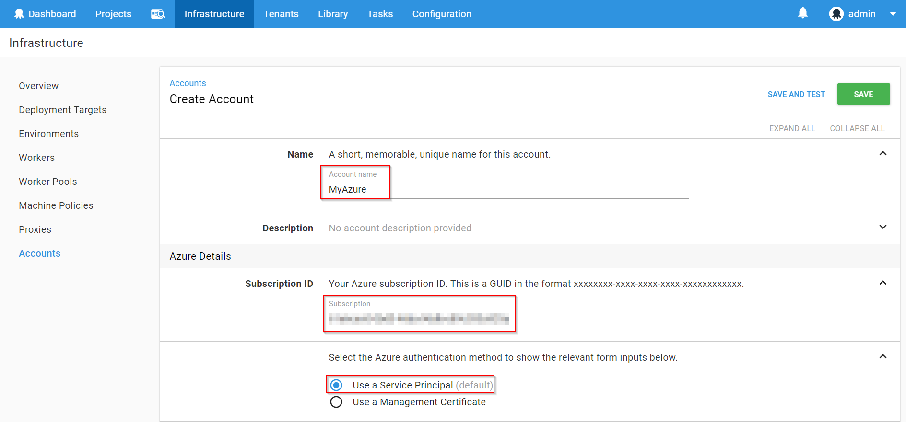

   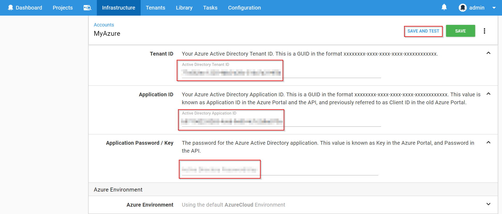

1. Click **SAVE AND TEST** and notice that your account is verified.

   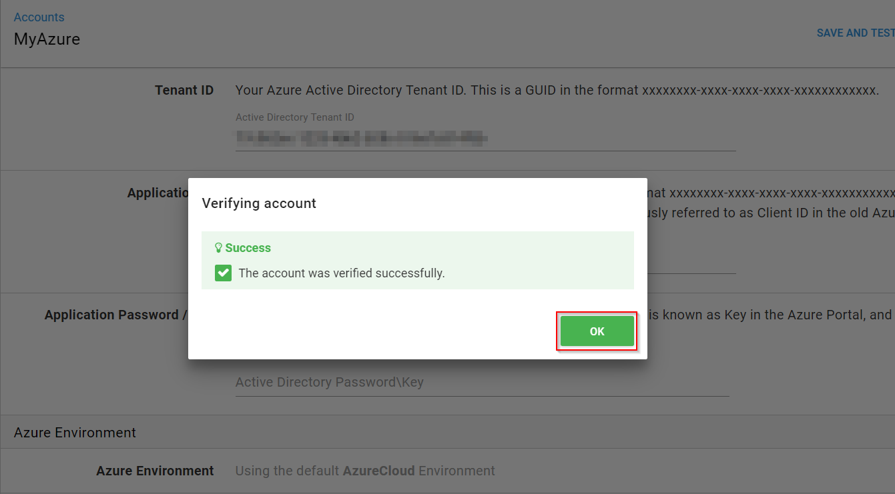

1. To add deployment target, go to **Deployment Targets**, click on **ADD DEPLOYMENT TARGET**, select **Azure Web App** and click **NEXT**.

   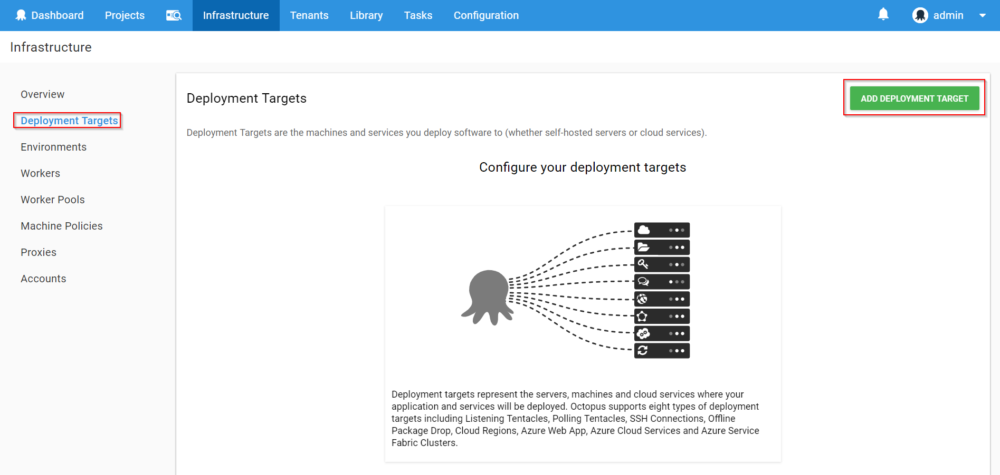

   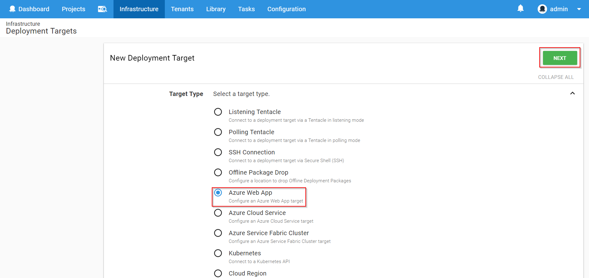

1. In create deployment target page provide **Display Name**, choose **Environment** from the dropdown, provide **Target Roles**, select the **Account** which was created earlier and select **Azure Web App** from the drpdown as shown below.

   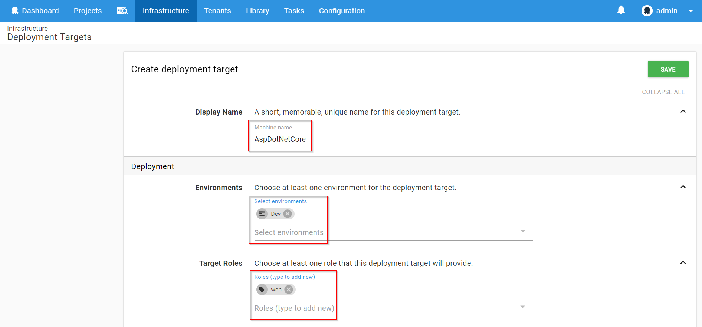

   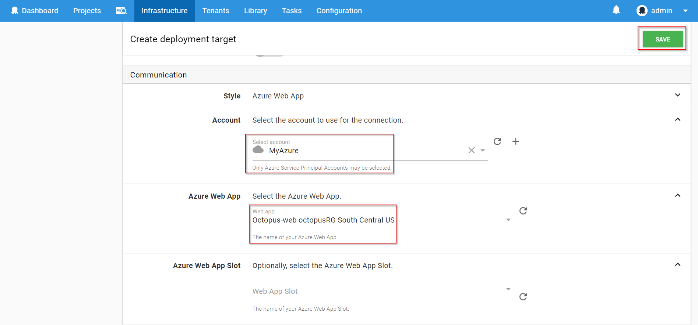

## Exercise 2: Create Project in Octopus

Let us create a Project in Octopus to deploy the package to **Azure App Service**. A [**Project**](https://octopus.com/docs/deployment-process/projects){:target="_blank"} is a collection of deployment steps and configuration variables that define how your software is deployed.

1. Go to Octopus dashboard and click on **Create a project**.

   

1. Click on **ADD PROJECT**, provide the project name, description and click on **SAVE**.

   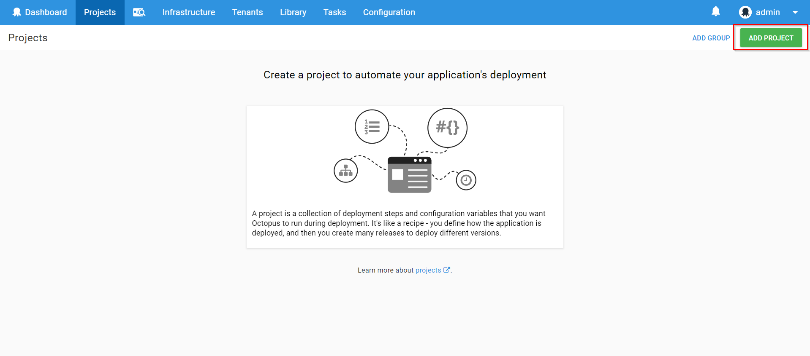

   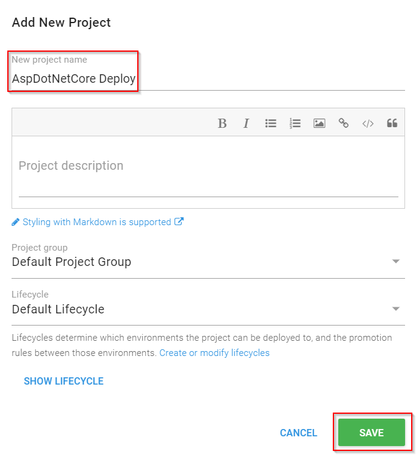

1. Once the project is created, click **Define your deployment process**. The [deployment process](https://octopus.com/docs/deploying-applications/deployment-process){:target="_blank"} is like a recipe for deploying your software.

   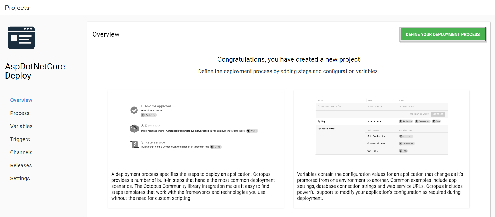

1. Click on **ADD STEP** to see a list of built-in step templates, custom step templates, and community contributed step templates.

   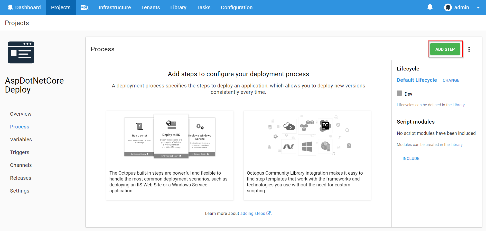

1. **Search** for **Azure Web App** template and click **Add**.

   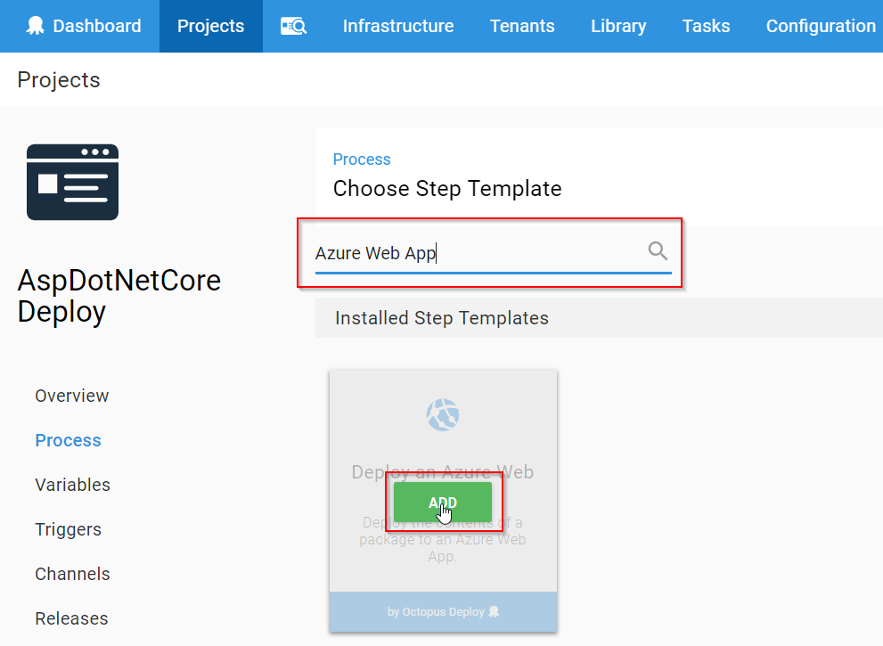

1. Populate the step template with required details -

   * **Step Name** : A short, unique name for the template.
   * **On Behalf Of** : Provide on behalf of target roles created in previous exercise step **8**. 
   * **Package ID** : Type-in as Asp.netcore (if you are providing different package ID, update it in Package Application task of the build definition)

   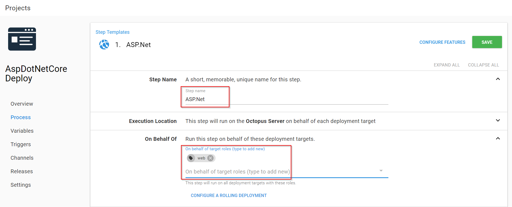

   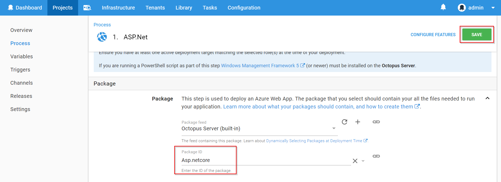

1. Clicking **Save** should define the project creation and its deployment process.

## Exercise 3: Triggering CI-CD

In this exercise, we will package ASP.NET Core application and push the package to Octopus Server. We will use build tasks of **Octopus Deploy Integration** extension which was installed during Team Project provisioning.

| Tasks| Usage|
|-------| ------|
| **Restore**| dotnet command-line tool restores all the package dependencies like **ASP.NET Core Identity, ASP.NET Core session** etc. required to build this project|
| **Build**| We will use dotnet command-line tool to build the project and its dependencies into a set of binaries|
| **Publish**| We will use this task to create a package with published content for the web deployment|
| **Package Application** | We will package the PHP source code into a zip file with the version number|
| **Push packages to Octopus**| The copied package will be pushed to Octopus server from VSTS artifacts directory|
| **Create Octopus Release**|Automates the creation of release in Octopus server. A release captures all the project and package details to be deployed over and over in a safe and repeatable way|
| **Deploy Octopus Release**| Automates the deployment of release in Octopus server. A deployment is the execution of the steps to deploy a release to an environment. An individual release can be deployed numerous times to different environments|

1. Go to **Builds** under **Pipelines** tab, select **Octopus** build definition and click on **Edit**.

   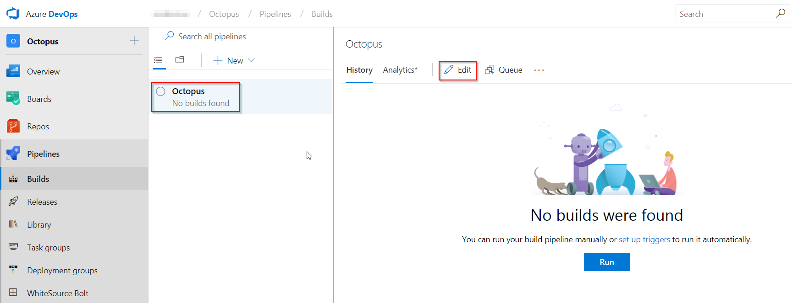

1. In **Push Packages to Octopus** task, update **Octopus Deploy Server** field with the created endpoint value.

   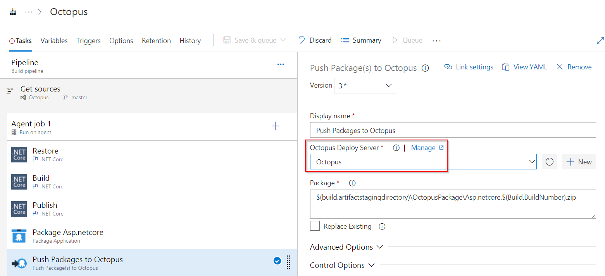

1. In **Create Octopus Release** task, update **Octopus Deploy Server** field with the created endpoint value and **Project** fields.

    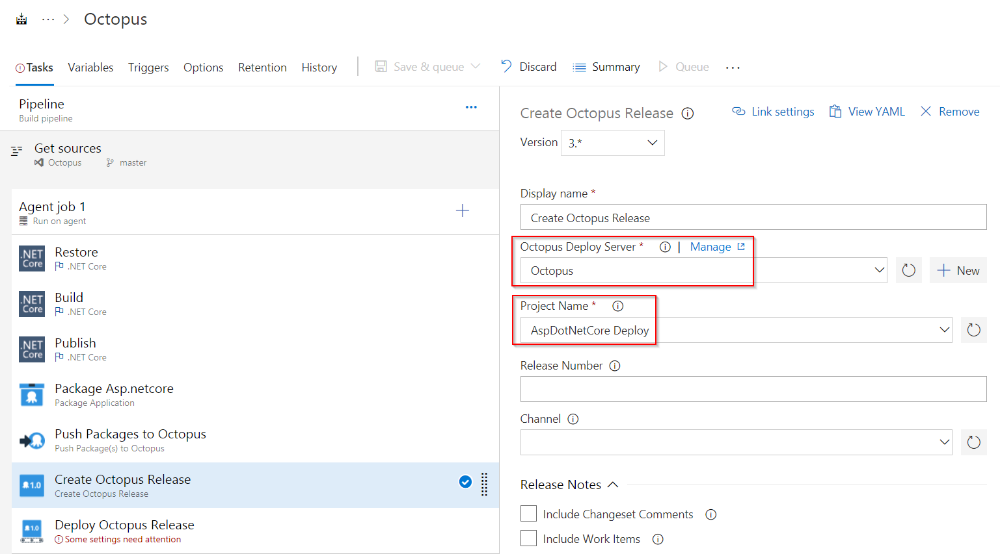

1. In **Deploy Octopus Release** task, update **Octopus Deploy Server** field with the created endpoint value, choose the appropriate values from the drop down for fields - **Project**  and **Deploy to Environments** and **Save** the build definition.

    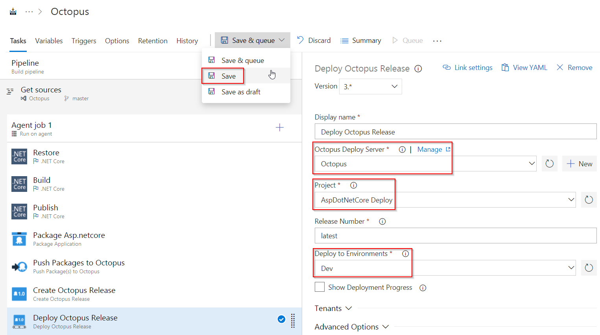

1. Navigate to **Repos** hub on the Azure DevOps portal.

   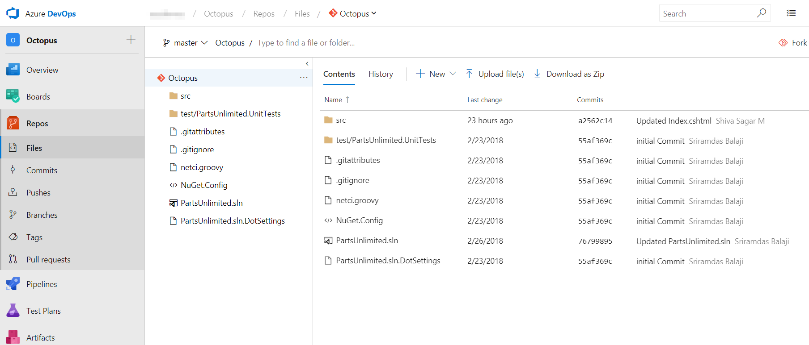

1. The repository contains an **ASP.NET Core** application source code provisioned by Azure DevOps Demo Generator.

   > The team project already has a Continuous Integration (CI) build configured that gets automatically initiated when the source code modifications are committed to the repository.

1. To edit source code, open file **Index.cshtml** by navigating to below path in the master branch and click on **Edit** :

   `Octopus/src/PartsUnlimitedWebsite/Views/Home/Index.cshtml`

   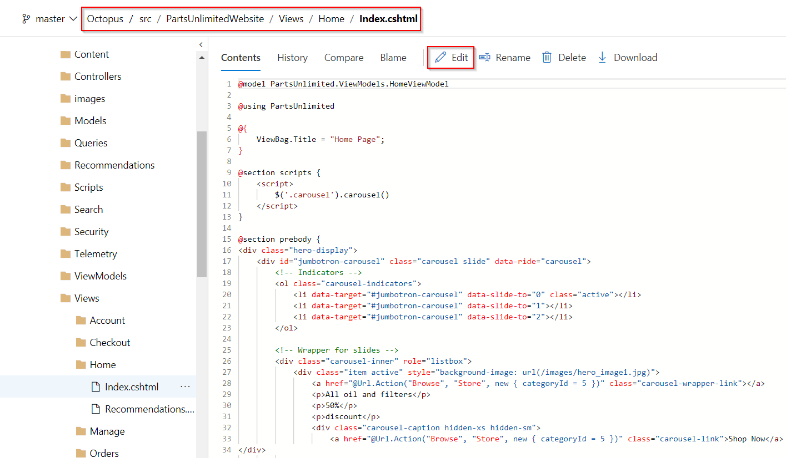

1. Make some small changes to the code. For this example, change discount percentage of `50%` to `70%` on `line 30` and then click on **Commit** to save and commit the changes.

   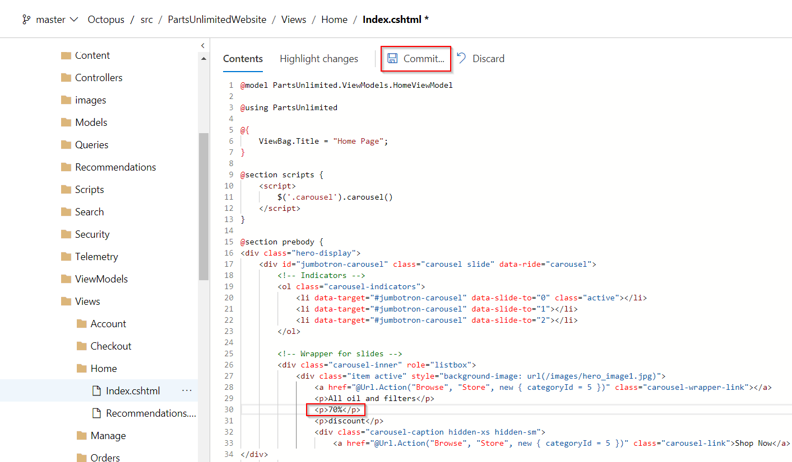

1. Go to **Build** tab, you will see in-progress build.

    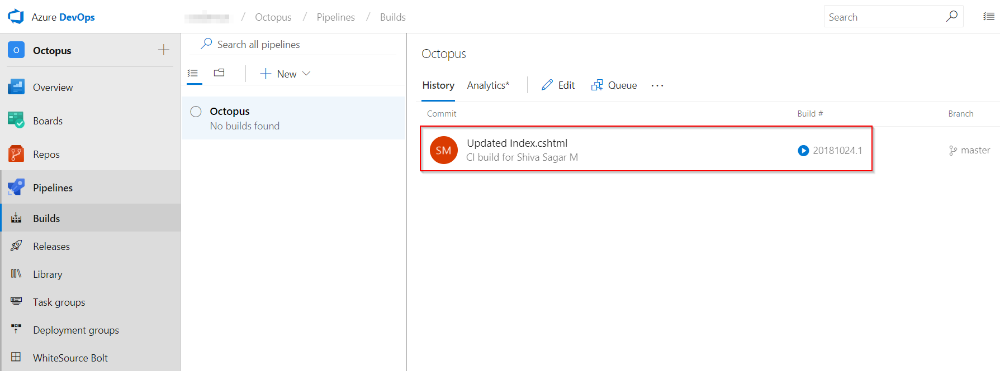

1. Once the build completes, go to Octopus portal project dashboard. You will see the release completion in Octopus.

    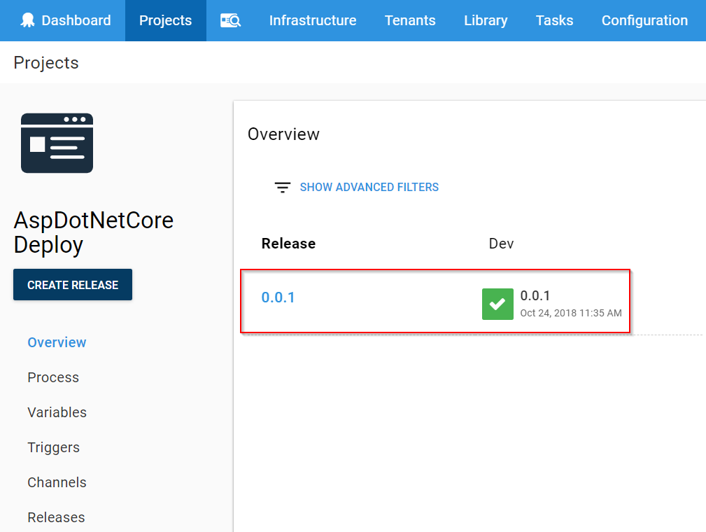

1. Go to Azure Web App from your **[Azure Portal](https://portal.azure.com){:target="_blank"}** and click on **Browse**.

   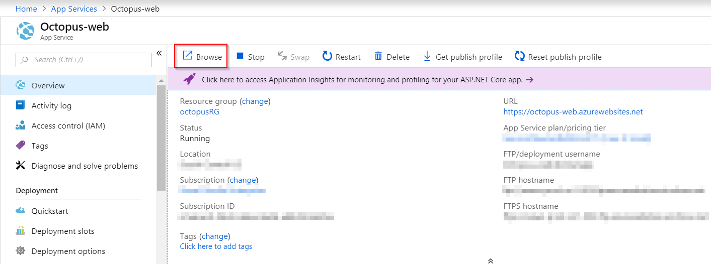

1. You will see an ASP.NET Core application up and running.

   
