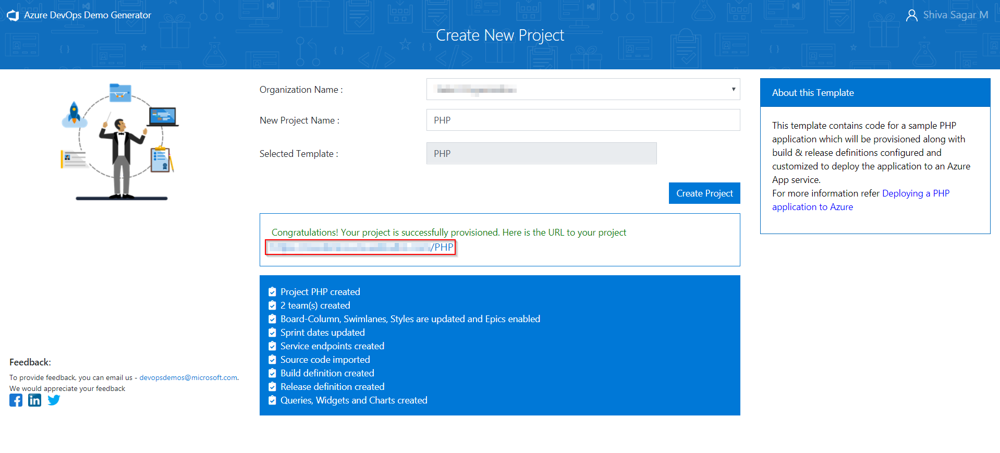
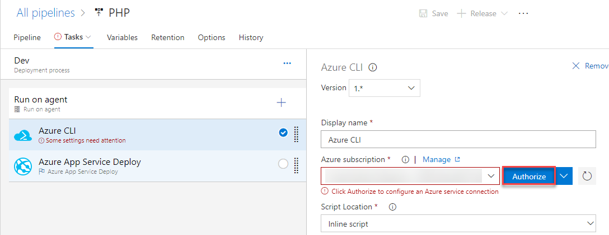

Last updated : {{ "now" | date: "%b %d, %Y" }}.
## Overview

**PHP** is a server-side scripting language and a powerful tool enough for making dynamic and interactive Web pages.

This lab shows how to deploy **PHP** application to **Azure App** service using **Azure DevOps**.

### Prerequisites for the lab

1. **Microsoft Azure Account**: You will need a valid and active Azure account for the Azure labs. If you do not have one, you can sign up for a [free trial](https://azure.microsoft.com/en-us/free/){:target="_blank"}

    * If you are an active Visual Studio Subscriber, you are entitled for a $50-$150 credit per month. You can refer to this [link](https://azure.microsoft.com/en-us/pricing/member-offers/msdn-benefits-details/){:target="_blank"} to get more information about this, including how to activate and start using your monthly Azure credit.

    * If you are not a Visual Studio Subscriber, you can sign up for FREE [Visual Studio Dev Essentials](https://www.visualstudio.com/dev-essentials/){:target="_blank"} program to create an **Azure free account** (includes 1 year of free services, $200 for 1st month).

1. You will need an **Azure DevOps Organization**. If you do not have one, you can sign up for free [here](https://www.visualstudio.com/products/visual-studio-team-services-vs){:target="_blank"}

## Setting Up the Azure DevOps Project

1. Use the [Azure DevOps Demo Generator](https://azuredevopsdemogenerator.azurewebsites.net/?TemplateId=77365&Name=PHP){:target="_blank"} to provision project on your Azure DevOps Organization. 

   > **Azure DevOps Demo Generator** helps you create team projects on your Azure DevOps Organization with sample content that include source code, work items, iterations, service endpoints, build and release definitions based on the template that you choose during the configuration.

   

1. Once the project is provisioned, click on the team project URL to navigate to the project.

   

   

## Exercise 1: Configure Release Definition

You will use ARM template as **Infrastructure as a Code** in the release definition to provision a Web App, and a Web App Service Plan under the specified resource group.

1. Go to **Releases** under **Pipelines** tab, select release definition **PHP** and click on **Edit**

   

1. Go to **Tasks** and select **Dev** environment.

   

1. Select the **Azure Resource Group Deployment** task, choose the **Azure subscription**. There are 2 ways of choosing the Azure subscription.
   
    * If your subscription is not listed or if you want to use an existing service principal, please click the `Manage` link. 

        1. Click on the `+New Service Connection` button and select the **Azure Resource Manager** option. Provide Connection name, select the Azure Subscription from the list and then click on the Ok button. The Azure credentials will be required to authorize the connection.

        

    * If the subscription is already listed, select the Azure subscription from the list and click `Authorize`.

        

1. Select the desired **Location** for deployment.

       

1. Select the **Azure App Service Deploy** task and pick **Azure subscription** from the dropdown list, then click on **Save**. 

        

   <table width="70%">
    <thead>
      <tr>
        <th width="60%"><b>Tasks</b></th>
        <th><b>Usage</b></th>
      </tr>
    </thead>
    <tr>
      <td> <b>Azure Resource Group Deployment</b></td>
      <td>Uses the provided ARM template to create a resource group with App Service plan and App Service</td>
    </tr>
    <tr>
      <td> <b>Azure App Service Deploy</b></td>
      <td>deploys a PHP application to the created App service</td>
    </tr>
   </table>

## Exercise 2: Deploying the application

**PHP** is an interpreted language, so you don't have to compile the code. Instead you will create an archive file which will be deployed to the Azure App Service.

Let's make a code change to trigger a CI-CD pipeline to build and deploy the application.

1. Go to **Repos** tab and navigate to the below path to edit the file.

   >php/config.php

   

1. Go to line number **11**, modify **PHP** to **DevOps for PHP using Azure DevOps** and commit the code.

   

1. Go to **Builds** tab under **Pipelines** to view the associated CI build in progress, click on ellipsis to **View build results**.

   

   

   Let's explore the build definition. The tasks used in the build definition are listed below.

   <table width="70%">
    <thead>
      <tr>
        <th width="60%"><b>Tasks</b></th>
        <th><b>Usage</b></th>
      </tr>
    </thead>
    <tr>
      <td> <b>Archive files</b></td>
      <td>We will archive all the files in the folder to a zip file</td>
    </tr>
    <tr>
      <td> <b>Copy Files</b></td>
      <td>Copy the ARM template and the Zip file to the artifact folder</td>
    </tr>
    <tr>
      <td> <b>Publish Build Artifacts</b></td>
      <td>Publish the build artifacts so that it is available to the Release pipeline</td>
    </tr>
   </table>

1. Once the build is completed, it triggers the CD pipeline. You can notice the linked release is in progress by navigating to **Releases** under **Pipelines**. The release will provision the Azure Web app and deploy the zip file generated by the associated build. Double click on **View release** and then click on **Logs** to view the release summary.

   

   

1. Alternatively, you can also login to the [Azure Portal](https://portal.azure.com){:target="_blank"} and navigate to the **Resource Group** that contains the Web App that was provisioned in the CD pipeline.

   

1. Select the **App Service** and from the **Overview** tab,  click **Browse** to see the application deployed.

   

## Summary

This lab shows how to create a continuous integration and continuous deployment pipeline for PHP code with Azure DevOps and Azure.

