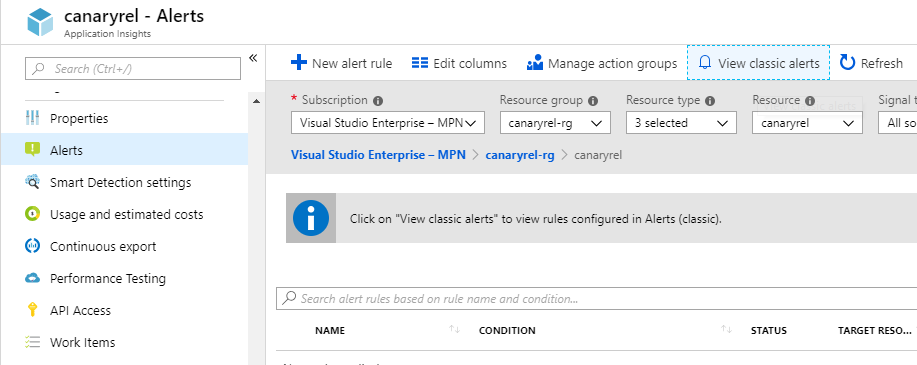
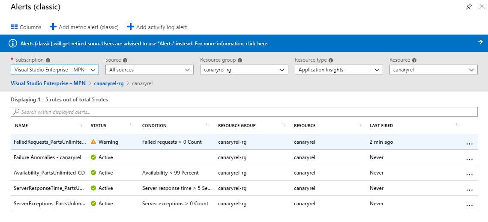
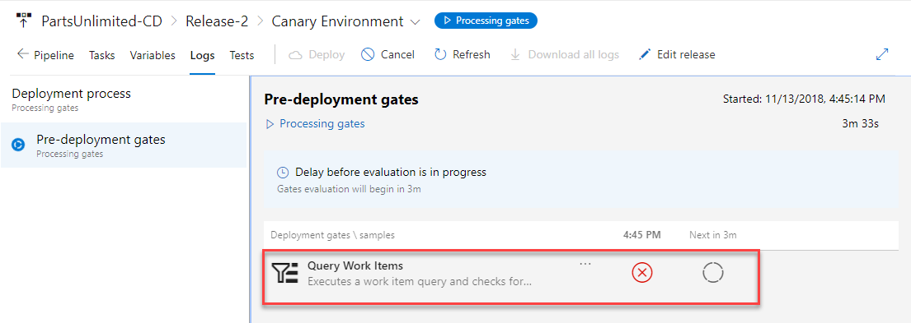
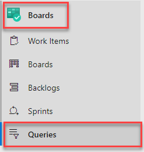
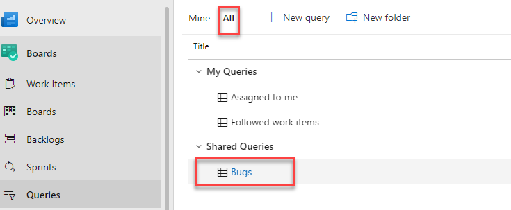
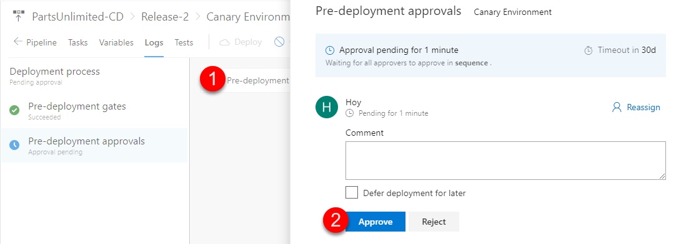
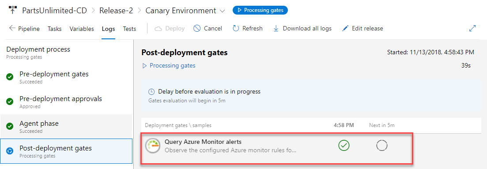
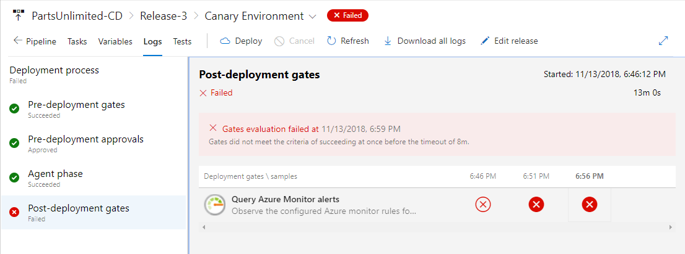
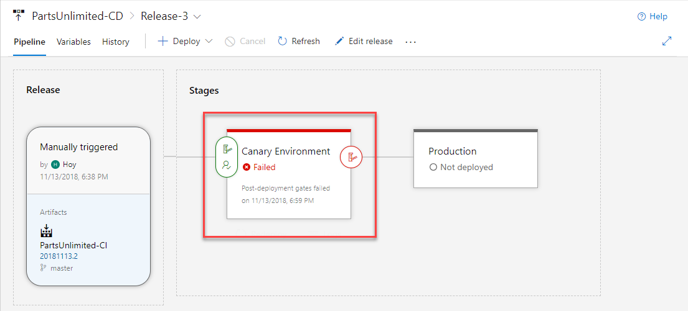

Last updated : {{ "now" | date: "%b %d,%Y" }}

## Overview

As you may be aware, a release pipeline specifies the end-to-end release process for an application to be deployed across a range of environments. Deployments to each environment are fully automated by using phases and tasks. 
Ideally, you do not want new updates to the applications to be exposed to all the users at the same time. It is a best practice to expose updates in a phased manner i.e. expose to a subset of users, monitor their usage and expose to other users based on the experience the initial set of users had.

Approvals and gates enable you to take control over the start and completion of the deployments in a release. 
With approvals, you can wait for users to manually approve or reject deployments.
Using release gates, you can specify application health criteria that must be met before release is promoted to the next environment. Prior to or after any environment deployment, all the specified gates are automatically evaluated until they all pass or until they reach your defined timeout period and fail.

Gates can be added to an environment in the release definition from the pre-deployment conditions or the post-deployment conditions panel. Multiple gates can be added to the environment conditions to ensure all the inputs are successful for the release.

As an example:

**Pre-deployment gates** ensures there are no active issues in the work item or problem management system before deploying a build to an environment.

**Post-deployment gates** ensures there are no incidents from the monitoring or incident management system for the app after it's been deployed, before promoting the release to next environment.

4 types of gates are included by default for every account.

1. **Invoke Azure function:** Trigger execution of an Azure function and ensures a successful completion. For more details, see [Azure function task](https://docs.microsoft.com/en-us/vsts/build-release/tasks/utility/azure-function)

1. **Query Azure monitor alerts:** Observe the configured Azure monitor alert rules for active alerts. For more details, see [Azure monitor task](https://docs.microsoft.com/en-us/vsts/build-release/tasks/utility/azure-monitor)

1. **Invoke REST API:** Make a call to a REST API and continue if it returns a successful response. For more details, see [HTTP REST API task](https://docs.microsoft.com/en-us/vsts/build-release/tasks/utility/http-rest-api)

1. **Query Workitems:** Ensures the number of matching work items returned from a query is within a threshold. For more details, see [Query Workitems task](https://docs.microsoft.com/en-us/vsts/build-release/tasks/utility/work-item-query)

## What's covered in this lab?

This lab covers the configuration of the deployment gates and details how to add control to Azure pipelines.
You will configure a release definition with two environments for an Azure Web App. You will deploy to the **Canary** environment only when there are no blocking bugs for the app and mark the Canary environment complete only when there are no active alerts in Azure Monitor (Application Insights). 

## Before you begin

1. Refer the [Getting Started](../Setup/) page to know the prerequisites for this lab.

1. Click the [Azure DevOps Demo Generator](https://azuredevopsdemogenerator.azurewebsites.net/?TemplateId=77375&Name=ReleaseGates) link and follow the instructions in [Getting Started](../Setup/) page to provision the project to your **Azure DevOps**.

## Setting up the Target Environment

You will create two **Web Apps** in Azure to depict two environments **Canary** and **Production** to deploy the application.

1. Go to [Azure portal](https://portal.azure.com) and click on **+New** and select **Web App**.
    
    

1. Provide a name for the **Web App**, create new **Resource Group** or select existing one from the dropdown. Enable **Application Insights** and click **Create**.
    
    

1. Once the deployment succeeds, navigate to your **Resource Group** to see the resources created.
    
    

1. You will see a Web App and an Application Insights being provisioned.
[Application Insights](https://azure.microsoft.com/en-in/services/application-insights/) is used to monitor the Web app.
    
    

1. Repeat **Step 1 & Step 2** to create Web App for **Production**.

## Exercise 1: Configure Release pipeline

### Update Release Tasks

1. Navigate to **Releases** under **Pipelines** and **Edit** the pipeline **PartsUnlimited-CD**. In this pipeline, you have two environments viz. *Canary Environment* & *Production*. Click on **“1 job, 3 tasks”** link for Canary Environment to update the tasks.
   

   

1. Canary environment has 3 tasks which will publish the package to Azure Web App, enables continuous monitoring of the application after deployment and also Application Insights Alerts will be configured. 

   

1. In Azure Subscription field, select your Azure subscription from the dropdown and click on **Authorize**. Provide your credentials, if required, to complete the authorization to your Azure account.

   

   

1. Select the App Service, Resource Group and Application Insights that you created for Canary environment from the dropdown.

   

1. For Production, select the **Azure subscription** from the dropdown. Pick the App service you created for Production and click on **Save** button.

   

1. Navigate to **Builds** under **Pipelines** and **Queue new build** for the build definition **PartsUnlimited-CI**.

   

   

1. After the build succeeds, the release will be triggered automatically and the application will be deployed to both the environments. Browse the websites after the application is deployed.

   

   

1. This will automatically hook the Web App with Application Insights and configure the Alerts in Azure under *CanaryRelease* Application Insights **Alerts** section. Click **View classic alerts** to view the metrics.

   

   

## Exercise 2: Configure Deployment Gates.

### Enabling Pre-deployment Gate

1. Edit the release pipeline **PartsUnlimited-CD** in *Releases* under **Pipelines**.

   

1. Click on **Pre-deployment conditions**. 

   

1. You will see **Triggers**, **Pre-deployment approvals**, **Gates** and **Deployment queue settings**. Enable **Pre-deployment approvals** and **Gates**.

   

1. Add yourself as an **Approver** and by default, user requesting a release or deployment should not approve. However for the purpose of this lab, **uncheck** this condition.

    
1. Add **Query Work Items** to the Gates.

   

1. Select **Bugs** under **Shared Queries** in the Query field. As maximum threshold is set to "0", if this query returns any active bug work Item, the release gate will fail.

   

1. Set the evaluation options.

   >*Delay before evaluation:* Time before the added gates are evaluated for the first time. If no gates are added, then the deployments wait for the duration before proceeding. To allow gate functions to initialize and stabilize (it may take some time for it to begin returning accurate results), we configure a delay before the results are evaluated and used to determine if the deployment should be approved or rejected.
   
   >*Time between re-evaluation of gates:* The time interval between each evaluation of all the gates. At each sampling interval, new requests are sent concurrently to each gate for fresh results. The sampling interval must be greater than the longest typical response time of any configured gate to allow time for all responses to be received.

   >*Timeout after which gates fail:* The maximum evaluation period for all gates. The deployment will be rejected if the timeout is reached before all gates succeed during the same sampling interval. The minimum value we can specify for timeout is 6 minutes and 5 minutes for sampling interval.

   For this demo purpose, set **Delay before evaluation** as *5 minutes* (so that you can see the results reasonably quick), **Time between re-evaluation of gates** as *5 minutes* (sampling interval) and **Timeout after which gates fail** as *8 minutes* but in reality these durations might be in hours. When the release is triggered, gate will validate the samples at *0th and 5th minutes*. If the result is "**Pass**", notification will be sent for approval. If the result is "**Fail**", the release will time-out after *8th minute*.

   Select **On successful gates, ask for approvals** radio button.

   

### Enabling Post-deployment Gate.

1. Click on **Post-deployment conditions**

   

1. Enable **Gates** and Add **Query Azure Monitor Alerts** to the gate.

   

1. Update the details from the dropdown. 

   

1.  Expand the **Evaluation options** and specify the *delay*, *sampling interval* and the *timeout*. Select **On successful gates, ask for approvals** radio button.

    

    >The sampling interval and timeout work together so that the gates will call their functions at suitable intervals and reject the deployment if they don't succeed during the same sampling interval within the timeout period. 

1. Click **Save** to save the changes.

## Exercise 3: Update and deploy application after adding release gates 
In this exercise, you will make a small code change in the application and commit to the repository which in-turn triggers build and release.

1. Go to **Repos** and click *Files*. Navigate to the path *"src/PartsUnlimitedWebsite/Views/Home/Index.cshtml"* and modify the content to ***"30%"*** from ***"20%"*** in **line 30**.

   

1. After the modification, **Commit** the changes.
   
   

1. The build will automatically trigger as we have *Continuous Integration (CI)* trigger type enabled in the build pipeline. Once the build succeeds, navigate to the **Releases** tab. You will notice the release have been triggered after the successful build.

1. Go to release **Logs** to see the progress. You will see **Query Work Items** gate have failed in delay before evaluation, which indicates there are active bugs. These bugs should be closed in-order to proceed further. Next sampling time will be after 5 minutes.

    
  
 
1. Navigate to **Queries** under **Boards** tab.

   

1. Select **Bugs** under **Shared Queries**.

   

1. You will see a bug with title "**Disk out of space in Canary Environment**" in **New** State.
Assuming that Infrastructure team has fixed the disk space issue, change the state to **Closed** and **Save** it.

    

1. Go back to release logs. You will see the evaluation has passed.

     

1. When the evaluation is successful, you will see the request for pre-deployment approval. Click on **Approve** to deploy in Canary environment

    

1. Once the deployment to Canary environment is successful, we will see the post-deployment gates in action which will start monitoring the application for any exceptions. 

    

1. Now, quickly verify the application. Go to *CanaryRelease* Azure Web App in 
Azure Portal and click on **Browse**.

   

1. After application is launched, click on **More**. You will encounter with an error page. Do this couple of times to trigger alerts.

   >This error scenario is just for the purpose of the lab and in real world, analysis of the alert and a resolution like “disabling a feature flag” or “upgrading the infra” would be realistic.

    
   
1. This exception is monitored by **Application Insights** which will trigger alert. In Azure Portal, we will be able to see the alert triggered.

   

1. As there was an alert triggered by the exception, **Query Azure Monitor** gate failed. However, the gate is still under delay period, you should wait for next evaluation to proceed.

   
   
1. As the next step, **Query Azure Monitor** gate will block the pipeline and prevents the deployment to **Production** Environment.

   
  
   

## Summary

Gates ensures that the release waits for you to react to the feedback and fix any issues within a timeout period. The gate samples continue to fail and the deployment waits until the issues are fixed. Once the issues are fixed, the next sample from the gates becomes successful and the deployment automatically proceeds.

If a new release is required to fix the issues, then you can cancel the deployment and manually abandon the current release.

So here are release gates, enabling teams to release applications with higher confidence with fewer manual steps. There is now a built-in audit of all the necessary criteria for a deployment being met.